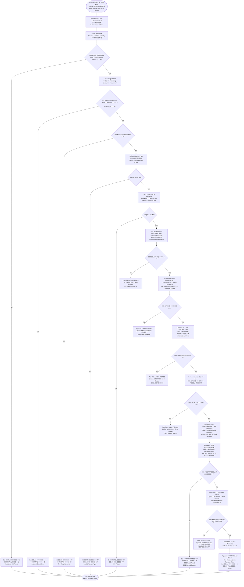

# CREACC — Bank Account Creation Service

## Program Overview

**CREACC** is a CICS-hosted COBOL program that implements the **bank account creation transaction** for the Bank of Z application. It acts as the **authoritative account provisioning service** within the core banking platform, responsible for atomically validating a customer, sequencing a new account number, persisting the account record to DB2, and writing an immutable audit trail to the processed transaction store — all within a single CICS task execution.

The program's inline comment precisely captures its mandate:

> *"Enqueue the Named Counter for ACCOUNT, increment the counter and take the new account number, & attempt to update the ACCOUNT datastore on DB2. If that is successful, write a rec to the PROCTRAN datastore."*

---

## Technology Stack

| Layer | Component | Role |
|---|---|---|
| **Transaction Monitor** | IBM CICS TS | Program execution, ENQ/DEQ, LINK, RETURN, ASKTIME/FORMATTIME |
| **Relational Database** | IBM Db2 for z/OS | ACCOUNT, PROCTRAN, and CONTROL tables via embedded SQL |
| **Precompiler** | IBM DB2 SQL precompiler (`CBL SQL`) | Expands embedded SQL statements at compile time |
| **Concurrency Control** | CICS ENQ/DEQ | Serializes access to the Named Counter Service (NCS) resource `BANKZACCT<sortcode>` |
| **Interprogram Communication** | CICS LINK | Synchronous calls to INQCUST, INQACCCU, and ABNDPROC |
| **Abend Handler** | ABNDPROC | Centralized abend logging and diagnostic program |
| **Copybooks** | SORTCODE, ACCDB2, PROCDB2, PROCTRAN, ACCOUNT, CUSTOMER, ACCTCTRL, INQCUSTZ, INQACCCU, ABNDINFO, CREACC | Shared data structure definitions across the application suite |

---

## Architectural Position & Integration Landscape

CREACC occupies a **core service position** in the Bank of Z CICS service mesh. It is a **downstream consumer** of customer and account inquiry services and an **upstream provider** of account data to any system that reads the ACCOUNT and PROCTRAN Db2 tables.

```
Caller (BMS Map / API Gateway)
        │
        │  CICS LINK via DFHCOMMAREA (CREACC copybook)
        ▼
   ┌─────────────┐
   │   CREACC    │  ◄─── Primary subject of analysis
   └──────┬──────┘
          │
          ├──── CICS LINK ────► INQCUST   (customer existence validation)
          │                     reads CUSTOMER Db2 table / VSAM KSDS
          │
          ├──── CICS LINK ────► INQACCCU  (customer account count check)
          │                     reads ACCOUNT Db2 table
          │
          ├──── DB2 SELECT ───► CONTROL table (SORTCODE-ACCOUNT-LAST row)
          ├──── DB2 UPDATE ───► CONTROL table (new last account number)
          ├──── DB2 SELECT ───► CONTROL table (SORTCODE-ACCOUNT-COUNT row)
          ├──── DB2 UPDATE ───► CONTROL table (incremented account count)
          │
          ├──── DB2 INSERT ───► ACCOUNT table (new account row)
          ├──── DB2 INSERT ───► PROCTRAN table (audit/transaction log row)
          │
          ├──── CICS ENQ ─────► NCS resource: BANKZACCT<sortcode>
          ├──── CICS DEQ ─────► NCS resource: BANKZACCT<sortcode>
          │
          └──── CICS LINK ────► ABNDPROC  (abend diagnostics, on error paths)
```

### Integration Points in Detail

| Integration Point | Direction | Protocol | Purpose |
|---|---|---|---|
| **INQCUST** | Outbound (sync) | CICS LINK + COMMAREA | Validates that `COMM-CUSTNO` refers to an existing customer. If `INQCUST-INQ-SUCCESS ≠ 'Y'`, creation is rejected with `COMM-FAIL-CODE = '1'`. |
| **INQACCCU** | Outbound (sync) | CICS LINK + COMMAREA (`SYNCONRETURN`) | Retrieves the count of existing accounts for the customer. Enforces the business rule that no customer may hold more than 9 accounts (`COMM-FAIL-CODE = '8'` if exceeded). |
| **CONTROL table (Db2)** | Bidirectional | Embedded SQL SELECT + UPDATE | Provides and maintains two sequential counters: `<SORTCODE>-ACCOUNT-LAST` (the last assigned account number) and `<SORTCODE>-ACCOUNT-COUNT` (total accounts in the system). These are incremented atomically under the CICS ENQ lock. |
| **ACCOUNT table (Db2)** | Outbound (write) | Embedded SQL INSERT | Persists the full new account record including customer number, sort code, account number, type, interest rate, balances, overdraft limit, opened date, last and next statement dates. |
| **PROCTRAN table (Db2)** | Outbound (write) | Embedded SQL INSERT | Writes an audit trail record of type `OCA` (Branch Create Account) that permanently records the account creation event with timestamp, task reference, and account metadata. |
| **CICS ENQ/DEQ (NCS)** | In-process | CICS resource locking | Serialises the read-increment-write cycle on the CONTROL table counter to prevent duplicate account number assignment under concurrent execution. The resource name is `BANKZACCT` concatenated with the 6-digit sort code. |
| **ABNDPROC** | Outbound (error path) | CICS LINK + COMMAREA | Called on any Db2 fatal error (SQLCODE ≠ 0 for CONTROL table operations or PROCTRAN insert). Receives a populated `ABNDINFO-REC` carrying applid, task number, transaction id, date/time, RESP codes, SQLCODE, and a free-form diagnostic string before issuing a `CICS ABEND` with codes `HNCS` or `HWPT`. |

---

## Business Logic & Rules

### Validation Pipeline (sequential, fail-fast)

1. **Customer existence check** — Links to INQCUST with `COMM-CUSTNO`. Failure → `COMM-FAIL-CODE = '1'`.
2. **Account count limit check** — Links to INQACCCU. Failure retrieving count → `COMM-FAIL-CODE = '9'`. Count > 9 → `COMM-FAIL-CODE = '8'`.
3. **Account type validation** — `COMM-ACC-TYPE` must be one of: `ISA`, `MORTGAGE`, `SAVING`, `CURRENT`, `LOAN`. Invalid → `COMM-FAIL-CODE = 'A'`.

### Account Number Sequencing (NCS-protected)

The program implements a **distributed sequence generator** using CICS ENQ/DEQ and the Db2 CONTROL table:

- Constructs the NCS resource name: `BANKZACCT` + `SORTCODE` (hard-coded as `987654`).
- Issues `EXEC CICS ENQ RESOURCE(NCS-ACC-NO-NAME)` to obtain an exclusive lock.
- Reads `SORTCODE-ACCOUNT-LAST` from the CONTROL table.
- Increments the value by 1 and updates the CONTROL table.
- The 8-digit suffix of `NCS-ACC-NO-VALUE` becomes the new `ACCOUNT-NUMBER`.
- Issues `EXEC CICS DEQ` after the Db2 INSERT (or on failure) to release the lock.

ENQ failure → `COMM-FAIL-CODE = '3'`. DEQ failure → `COMM-FAIL-CODE = '5'`.

### Date Calculations

- **Account Opened / Last Statement Date**: Set to today's date via `CICS ASKTIME` + `FORMATTIME`.
- **Next Statement Date** (`WS-FUTURE-DATE`): Calculated as today + 30 days using `INTEGER-OF-DATE` / `DATE-OF-INTEGER` intrinsic functions. February months apply leap-year logic (÷4, ÷100, ÷400 algorithm).

### PROCTRAN Audit Record

The audit record written to PROCTRAN uses transaction type `OCA` (Branch Create Account — matching the `PROC-TY-BRANCH-CREATE-ACCOUNT` 88-level). The description field is packed with: customer number, account type, last statement date, next statement date, and a `CREATE` footer flag.

---

## COMM-FAIL-CODE Reference

| Code | Meaning |
|---|---|
| `' '` | Success |
| `'1'` | Customer not found (INQCUST failed or returned not-found) |
| `'3'` | CICS ENQ on Named Counter failed |
| `'5'` | CICS DEQ on Named Counter failed |
| `'7'` | Db2 INSERT into ACCOUNT table failed |
| `'8'` | Customer already holds 9 or more accounts |
| `'9'` | Error retrieving account count from INQACCCU |
| `'A'` | Invalid account type supplied |

---

## Program Flow



---

## Key Architectural Observations

### Concurrency & Data Integrity
The **ENQ/DEQ bracket around the entire account number generation and Db2 write cycle** is a critical design choice. Because the CONTROL table acts as a shared sequence generator, concurrent CREACC tasks running on the same CICS region could corrupt the sequence without this serialisation gate. The ENQ resource name incorporates the sort code, making the lock scope **institution-specific** and supporting potential multi-bank deployments.

### Fail-Fast Validation Pattern
CREACC applies a strict **sequential validation funnel**: customer existence → account count → account type. Each gate is tested before acquiring the ENQ lock, minimising resource contention. Only after all business rules pass does the program engage the NCS lock, a pattern that improves throughput in high-concurrency environments.

### Audit Trail Architecture
Every successful account creation produces a `PROCTRAN` record of type `OCA` (Branch Create Account). This provides a **non-repudiable, time-stamped audit log** that is fully decoupled from the ACCOUNT table itself, supporting regulatory reporting, reconciliation, and event sourcing patterns without requiring changes to the core ACCOUNT record.

### Abend Code Taxonomy
The program uses two distinct abend codes — `HNCS` (Named Counter / CONTROL table failure) and `HWPT` (PROCTRAN write failure) — enabling operations teams to **triage production failures by abend code** without reading diagnostic dumps.

### Hard-Coded Sort Code
`SORTCODE` is defined as `PIC 9(6) VALUE 987654` in the SORTCODE copybook. This is a **configuration concern** that constrains the program to a single institution's sort code at compile time. A modernisation pathway would externalise this to a CICS resource definition or environment variable.

---

Generated by IBM Bob Premium Package for Z
