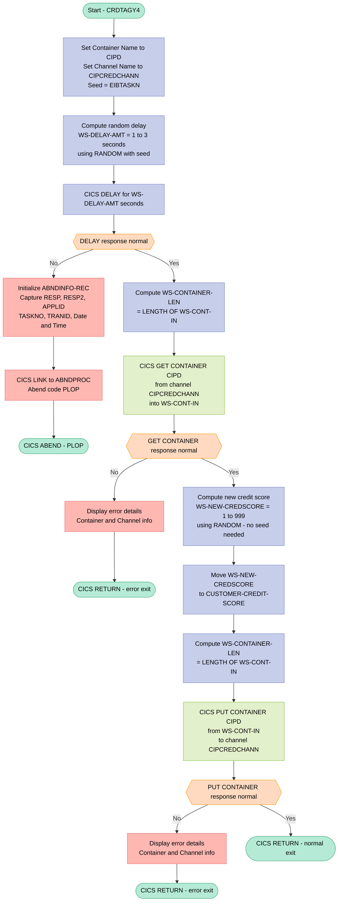

## 1. Purpose

`CRDTAGY4` is a simulated credit agency program that operates within the CICS Asynchronous API framework, acting as one of potentially several dummy credit scoring services invoked by a parent program. When called, it receives a customer data record through a named CICS channel (`CIPCREDCHANN`) and container (`CIPD`), introduces a random processing delay of between 1 and 3 seconds to emulate the unpredictable response time of a real external credit bureau, generates a random credit score between 1 and 999 for the customer, and writes the updated customer record — now containing the new credit score — back into the same container for the parent program to retrieve. Because the parent program enforces a fixed 3-second timeout window, this deliberate randomised delay means there is approximately a one-in-three chance that the response will not be returned within the allowed time, intentionally simulating the real-world scenario where a credit agency does not always respond promptly. Throughout execution the program includes standard CICS error handling, capturing RESP and RESP2 codes and linking to a centralised abend handler (`ABNDPROC`) should any CICS command fail.

## 2. Inputs

**CICS Channel/Container (External Data)**

- `WS-CONT-IN` — Customer data record retrieved from the CICS container `CIPD` on channel `CIPCREDCHANN` via `EXEC CICS GET CONTAINER`. This is the primary external input driving all processing; it carries the full customer record that the program reads, updates with a newly generated credit score, and writes back.
  - `CUSTOMER-RECORD` — The full customer data structure populated from the container, containing all fields below as sub-inputs:
    - `CUSTOMER-EYECATCHER` — Four-character identifier (`CUST`) that marks the record as a valid customer record.
    - `CUSTOMER-KEY` — Composite key identifying the customer, composed of:
      - `CUSTOMER-SORTCODE` — Six-digit sort code identifying the bank branch.
      - `CUSTOMER-NUMBER` — Ten-digit unique customer identifier.
    - `CUSTOMER-NAME` — Customer's full name, composed of:
      - `CUSTOMER-TITLE` — Customer's title (e.g., Mr, Mrs).
      - `CUSTOMER-FIRST-NAME` — Customer's first name.
      - `CUSTOMER-LAST-NAME` — Customer's last name.
    - `CUSTOMER-DOB` — Customer's date of birth, composed of day, month, and year sub-fields.
    - `CUSTOMER-PHONE` — Customer's phone number.
    - `CUSTOMER-ADDRESS` — Customer's postal address, composed of address lines, city, postcode, and country.
    - `CUSTOMER-STATUS` — Customer's current status (`ACTIVE`, `INACTIVE`, or `SUSPENDED`).
    - `CUSTOMER-CREATED-DATE` — Date the customer record was originally created.
    - `CUSTOMER-CREDIT-SCORE` — The existing credit score field within the container record; the program overwrites this field with a newly generated random value before writing the record back.
    - `CUSTOMER-CS-REVIEW-DATE` — Date of the last or next scheduled credit score review.

**CICS Execution Context (Runtime Environment)**

- `EIBTASKN` — CICS Execute Interface Block field providing the current task number at runtime. Used both as the seed for the `RANDOM` function (to produce a unique random delay per task) and as a diagnostic key (`ABND-TASKNO-KEY`) in abend records.
- `EIBTRNID` — CICS EIB field supplying the current transaction identifier, captured into abend diagnostic records on failure.
- `EIBRESP` / `EIBRESP2` — CICS EIB response code fields read after each CICS command (`DELAY`, `GET CONTAINER`, `PUT CONTAINER`) to determine whether the operation succeeded; non-normal responses trigger abend handling.
- `ABND-APPLID` (populated via `EXEC CICS ASSIGN APPLID`) — The CICS region application identifier retrieved from the runtime environment and stored in the abend record when a failure occurs.
- `ABND-PROGRAM` (populated via `EXEC CICS ASSIGN PROGRAM`) — The currently executing program name retrieved from the CICS runtime and written to the abend diagnostic record on failure.

## 3. Outputs

**CICS Container PUT (Primary Output)**
- `WS-CONT-IN` — the full customer data record written back to the CICS container `CIPD` on channel `CIPCREDCHANN` via `EXEC CICS PUT CONTAINER`. This is the program's sole primary data output, returning the enriched customer record to the calling parent program through the Async API channel.
  - `CUSTOMER-CREDIT-SCORE` — the specific field within `WS-CONT-IN` that is updated with the newly generated random credit score (`WS-NEW-CREDSCORE`, range 1–999) before the container is written back. This is the single piece of computed data the program is responsible for producing.

**CICS Abend Handler Invocation (Error Path Output)**
- `ABNDINFO-REC` — the abend diagnostic communication area passed via `EXEC CICS LINK PROGRAM('ABNDPROC') COMMAREA(ABNDINFO-REC)` when the `CICS DELAY` command fails. This record represents a structured output passed to the centralised error-handling program and contains:
  - `ABND-APPLID` — the CICS application ID of the failing region, populated via `EXEC CICS ASSIGN APPLID`.
  - `ABND-TRANID` — the transaction ID from `EIBTRNID` at the time of failure.
  - `ABND-TASKNO-KEY` — the CICS task number from `EIBTASKN`, used as part of the VSAM key for the abend record.
  - `ABND-UTIME-KEY` — the CICS absolute time from `WS-U-TIME`, used as the other component of the VSAM key.
  - `ABND-DATE` — the formatted date (`DD/MM/YYYY`) at the time of the abend, sourced from `WS-ORIG-DATE`.
  - `ABND-TIME` — the formatted time string (`HH:MM:MM`) at the time of the abend, built from `WS-TIME-NOW-GRP-HH` and `WS-TIME-NOW-GRP-MM`.
  - `ABND-CODE` — the literal abend code `'PLOP'` identifying this specific failure point.
  - `ABND-PROGRAM` — the name of the currently executing CICS program, populated via `EXEC CICS ASSIGN PROGRAM`.
  - `ABND-RESPCODE` — the CICS `EIBRESP` response code from the failed `DELAY` command.
  - `ABND-RESP2CODE` — the CICS `EIBRESP2` secondary response code from the failed `DELAY` command.
  - `ABND-SQLCODE` — set to zeros (no DB2 interaction occurs in this program).
  - `ABND-FREEFORM` — a free-text diagnostic message: `'A010 - *** The delay messed up! *** EIBRESP=<code> RESP2=<code>'`.

**CICS ABEND Termination (Error Path Output)**
- `EXEC CICS ABEND ABCODE('PLOP')` — issued after the link to `ABNDPROC` on `DELAY` failure, terminating the CICS task with abend code `PLOP` as an observable platform-level signal.

**Console DISPLAY Messages (Diagnostic Outputs)**
- On `CICS DELAY` failure:
  - `'*** The delay messed up ! ***'`
- On `CICS GET CONTAINER` failure:
  - `'CRDTAGY4 - UNABLE TO GET CONTAINER. RESP=<resp> , RESP2=<resp2>'`
  - `'CONTAINER=<name> CHANNEL=<name> FLENGTH=<len>'`
- On `CICS PUT CONTAINER` failure:
  - `'CRDTAGY4- UNABLE TO PUT CONTAINER. RESP=<resp> , RESP2=<resp2>'`
  - `'CONTAINER=<name> CHANNEL=<name> FLENGTH=<len>'`

## 4. Business Rules

**Program:** CRDTAGY4

**Total Rules Extracted:** 1

### 4.1 Paragraph: PREMIERE_A010

#### 4.1.1 Generate Random Credit Agency Response Delay

**Purpose:** Calculates a random delay amount between 1 and 3 seconds using the CICS task number as a seed, simulating variable response time from an external credit agency. This introduces realistic non-deterministic latency into the credit scoring process.

**Core Decision Logic:**
- Delay duration is randomly generated within the range of 1 to 3 seconds to simulate variable credit agency response time
- The CICS task number (EIBTASKN) is used as the random seed to ensure a unique delay per task execution

**Code:**
```cobol
           COMPUTE WS-DELAY-AMT = ((3 - 1)
                            * FUNCTION RANDOM(WS-SEED)) + 1.
```


## 5. Processing logic

### 5.1 Mermaid Flow Diagram



---

### 5.2 Processing Logic Description

#### 5.2.1 High-level Summary

`CRDTAGY4` is a **simulated credit agency program** operating within a CICS environment. Its purpose is to mimic the behaviour of an external credit bureau by accepting a customer record via a CICS channel/container, introducing a random processing delay (1–3 seconds) to emulate variable network/agency response times, generating a random credit score (1–999), and writing the updated customer record back to the same container for the parent program to consume. It is designed to be driven **asynchronously** by its parent, with a deliberate chance of not completing within the parent's timeout window.

---

#### 5.2.2 Execution Flow

**Step 1 — Initialization (`A010`)**
The program begins by setting up the key channel and container identifiers:
- `WS-CONTAINER-NAME` = `'CIPD'`
- `WS-CHANNEL-NAME` = `'CIPCREDCHANN'`
- `WS-SEED` is loaded from `EIBTASKN` (the current CICS task number), ensuring a unique random seed per task invocation.

**Step 2 — Compute and Apply Random Delay**
A random delay amount is calculated using:
```
WS-DELAY-AMT = ((3 - 1) * RANDOM(WS-SEED)) + 1
```
This produces a value in the range of **1 to 3 seconds**. The CICS `DELAY FOR SECONDS` command then suspends the task for that duration. This simulates the variable response time of a real external credit agency.

> **Business Rule:** The parent program allows a maximum 3-second wait window. Since this program may delay up to 3 seconds, there is approximately a **1-in-3 chance** it will not respond within the parent's timeout — intentionally simulating unreliable external agency communication.

**Step 3 — Delay Error Handling**
If the `CICS DELAY` command returns a non-normal response code:
- `ABNDINFO-REC` is fully populated with diagnostic data: `EIBRESP`, `EIBRESP2`, application ID, task number, transaction ID, date, time, abend code (`PLOP`), and a descriptive freeform message.
- The `POPULATE-TIME-DATE` subroutine is called to capture the current date and time via `CICS ASKTIME` and `CICS FORMATTIME`.
- `CICS LINK` is called to transfer control to the `ABNDPROC` error-handling program, passing the populated `ABNDINFO-REC` as the communication area.
- A `CICS ABEND ABCODE('PLOP')` is then issued to forcibly terminate the task.

**Step 4 — GET Container**
The byte length of `WS-CONT-IN` is computed and stored in `WS-CONTAINER-LEN`. A `CICS GET CONTAINER` command retrieves the customer record from container `CIPD` on channel `CIPCREDCHANN` into the working storage buffer `WS-CONT-IN`.

If the GET fails, diagnostic details are displayed and the program exits cleanly via `GET-ME-OUT-OF-HERE` (which issues `CICS RETURN`).

**Step 5 — Generate Random Credit Score**
A new credit score is computed using:
```
WS-NEW-CREDSCORE = ((999 - 1) * RANDOM) + 1
```
Note: No seed is provided here because the random sequence was already seeded in Step 2 — subsequent calls to `RANDOM` without a seed continue the same sequence, ensuring statistical variety.

The generated score (range **1–999**) is moved into `CUSTOMER-CREDIT-SCORE` within `WS-CONT-IN`.

**Step 6 — PUT Container**
The updated customer record buffer (now containing the new credit score) is written back to container `CIPD` on channel `CIPCREDCHANN` using `CICS PUT CONTAINER`. If the PUT fails, diagnostic details are displayed and the program exits via `GET-ME-OUT-OF-HERE`.

**Step 7 — Normal Exit**
On success, `GET-ME-OUT-OF-HERE` executes `CICS RETURN`, cleanly returning control to the CICS task dispatcher.

**`POPULATE-TIME-DATE` Subroutine**
Used only during error handling. It calls:
- `CICS ASKTIME` — retrieves the absolute CICS system time into `WS-U-TIME`.
- `CICS FORMATTIME` — formats that time into a DD/MM/YYYY date (`WS-ORIG-DATE`) and HHMMSS time (`WS-TIME-NOW`).

---

#### 5.2.3 External Interactions

| Interaction | Command | Purpose |
|---|---|---|
| CICS Channel/Container (GET) | `EXEC CICS GET CONTAINER` | Reads the customer record passed by the parent program via the `CIPCREDCHANN` channel, container `CIPD` |
| CICS Channel/Container (PUT) | `EXEC CICS PUT CONTAINER` | Writes the updated customer record (with new credit score) back to the same channel and container for the parent to retrieve |
| CICS DELAY | `EXEC CICS DELAY FOR SECONDS` | Simulates variable external agency response time (1–3 second random delay) |
| CICS ABNDPROC (LINK) | `EXEC CICS LINK PROGRAM('ABNDPROC')` | Invokes the standard abend handler program on any CICS error, passing full diagnostic context |
| CICS ABEND | `EXEC CICS ABEND ABCODE('PLOP')` | Forces task termination with a named abend code when delay processing fails |
| CICS ASKTIME / FORMATTIME | Diagnostic support | Retrieves and formats current system date and time for abend records |

---

#### 5.2.4 Plain Language Summary

Imagine `CRDTAGY4` as a **stand-in for an external credit bureau**. When a banking application needs to check a customer's creditworthiness, it calls this program and passes the customer's details through an internal CICS data channel.

This program first **waits a random amount of time** (between 1 and 3 seconds) to realistically simulate the latency of a real-world credit check over a network. The parent application only waits up to 3 seconds — so sometimes this program won't finish in time, just like a real credit agency might not always respond promptly.

Once the wait is over, the program **reads the customer's record**, **makes up a random credit score** between 1 and 999, **writes that score back** into the customer record, and returns it to the calling application via the same data channel.

If anything goes wrong at any point — the delay fails, the read fails, or the write fails — the program **logs full diagnostic information** and calls a dedicated error handler before shutting down.

---

### 5.3 Database Tables

No relational database tables are accessed in `CRDTAGY4`. All data exchange is performed exclusively through **CICS channels and containers** (in-memory inter-program communication), with no VSAM file I/O or DB2 SQL operations present in this program.

## 6. Paragraphs

### 6.1 `A010` — Main Processing Paragraph

**Purpose:** This is the primary entry paragraph of the program. It orchestrates the full credit-scoring simulation: generating a random processing delay, retrieving the customer record from a CICS container, computing a new random credit score, and writing the updated record back to the container.

- Initialises channel and container name identifiers:
  - Moves `'CIPD'` into `WS-CONTAINER-NAME`
  - Moves `'CIPCREDCHANN'` into `WS-CHANNEL-NAME`
- Seeds the random number generator using `EIBTASKN` (current CICS task number) stored in `WS-SEED`
- Computes a random delay between 1 and 3 seconds using `FUNCTION RANDOM(WS-SEED)` and stores it in `WS-DELAY-AMT`
- Issues a `CICS DELAY FOR SECONDS(WS-DELAY-AMT)` to simulate variable response latency from an external credit agency
  - On failure (`WS-CICS-RESP NOT = DFHRESP(NORMAL)`):
    - Initialises `ABNDINFO-REC` and populates it with `EIBRESP`, `EIBRESP2`, `ABND-APPLID` (via `CICS ASSIGN`), task number, transaction ID, current date/time (via `PERFORM POPULATE-TIME-DATE`), abend code `'PLOP'`, program name, zeroed SQL code, and a descriptive freeform message
    - Links to the abend handler program (`ABNDPROC`) via `CICS LINK PROGRAM(WS-ABEND-PGM) COMMAREA(ABNDINFO-REC)`
    - Issues `CICS ABEND ABCODE('PLOP')` to force abnormal termination
- Computes `WS-CONTAINER-LEN` as the byte length of `WS-CONT-IN`
- Retrieves the customer data record via `CICS GET CONTAINER(WS-CONTAINER-NAME) CHANNEL(WS-CHANNEL-NAME) INTO(WS-CONT-IN) FLENGTH(WS-CONTAINER-LEN)`
  - On failure: displays diagnostic messages showing container name, channel, length, response codes, then `PERFORM GET-ME-OUT-OF-HERE`
- Generates a new credit score in the range 1–999 using `FUNCTION RANDOM` (no seed, continuing the existing random sequence) and stores it in `WS-NEW-CREDSCORE`
- Moves `WS-NEW-CREDSCORE` into `CUSTOMER-CREDIT-SCORE OF WS-CONT-IN` to update the customer record
- Recomputes `WS-CONTAINER-LEN` and writes the updated record back via `CICS PUT CONTAINER(WS-CONTAINER-NAME) FROM(WS-CONT-IN) FLENGTH(WS-CONTAINER-LEN) CHANNEL(WS-CHANNEL-NAME)`
  - On failure: displays diagnostic messages with container name, channel, length, response codes, then `PERFORM GET-ME-OUT-OF-HERE`
- On success, unconditionally calls `PERFORM GET-ME-OUT-OF-HERE` to return control to CICS

---

### 6.2 `A999` — End of `PREMIERE` Section

**Purpose:** Acts as the formal section terminator for the `PREMIERE SECTION`. Contains only an `EXIT` statement and is never explicitly branched to; it marks the boundary of the section.

---

### 6.3 `GET-ME-OUT-OF-HERE` — CICS Return Paragraph

**Purpose:** Provides a single, centralised exit point from the program by issuing a `CICS RETURN` to return control to the CICS transaction manager. It is called both on error conditions and on successful completion of processing.

- Issues `EXEC CICS RETURN END-EXEC` unconditionally, terminating the current CICS task and returning control to the caller or CICS dispatcher
- No conditional logic; serves purely as a clean exit routine

---

### 6.4 `GMOFH999` — End of `GET-ME-OUT-OF-HERE` Section

**Purpose:** Acts as the formal section terminator for the `GET-ME-OUT-OF-HERE SECTION`. Contains only an `EXIT` statement marking the section boundary.

---

### 6.5 `POPULATE-TIME-DATE` — Date and Time Population Paragraph

**Purpose:** Retrieves the current CICS absolute time and formats it into a human-readable date and time, populating the working-storage fields used to construct abend diagnostic records.

- Issues `EXEC CICS ASKTIME ABSTIME(WS-U-TIME)` to obtain the current CICS absolute time value and store it in the packed-decimal field `WS-U-TIME`
- Issues `EXEC CICS FORMATTIME ABSTIME(WS-U-TIME) DDMMYYYY(WS-ORIG-DATE) TIME(WS-TIME-NOW) DATESEP` to:
  - Format the absolute time into a `DD/MM/YYYY` date string, stored in `WS-ORIG-DATE`
  - Format the time component into `HHMMSS`, stored in `WS-TIME-NOW` (which is overlaid by the `WS-TIME-NOW-GRP` redefinition providing `HH`, `MM`, and `SS` sub-fields)
- No conditional logic; called exclusively from the `A010` error-handling block when a `CICS DELAY` failure occurs

---

### 6.6 `PTD999` — End of `POPULATE-TIME-DATE` Section

**Purpose:** Acts as the formal section terminator for the `POPULATE-TIME-DATE SECTION`. Contains only an `EXIT` statement marking the section boundary.

## 7. Dependencies

### 7.1 CICS Runtime Environment

- **CICS Transaction Server** — The program is compiled and executed exclusively within a CICS region (`CBL CICS('SP,EDF')`). All I/O, timing, flow control, and error handling rely entirely on CICS services.
  - **EXEC CICS DELAY** — Suspends the task for a randomly computed number of seconds (1–3) to simulate variable external credit agency response latency.
  - **EXEC CICS GET CONTAINER** — Reads the customer record from the named CICS container (`CIPD`) within the named channel (`CIPCREDCHANN`) into the working-storage buffer `WS-CONT-IN`.
  - **EXEC CICS PUT CONTAINER** — Writes the updated customer record (with the newly generated credit score) back into the same container (`CIPD`) and channel (`CIPCREDCHANN`) for consumption by the parent program.
  - **EXEC CICS ASSIGN APPLID / PROGRAM** — Retrieves the CICS application ID and current program name to populate the abend diagnostic record.
  - **EXEC CICS ASKTIME** — Obtains the current CICS absolute time, stored in `WS-U-TIME`, used to timestamp abend records.
  - **EXEC CICS FORMATTIME** — Converts the absolute time value into a formatted date (`DD/MM/YYYY`) and time (`HHMMSS`) for abend diagnostics.
  - **EXEC CICS LINK PROGRAM(ABNDPROC)** — Transfers control to the abend handler program when a CICS DELAY failure is detected, passing `ABNDINFO-REC` as the COMMAREA.
  - **EXEC CICS ABEND ABCODE('PLOP')** — Forces a CICS abend with code `PLOP` after abend handler linkage if the DELAY command fails.
  - **EXEC CICS RETURN** — Terminates the task and returns control to CICS.

### 7.2 CICS Channel and Container Interface

- **Channel `CIPCREDCHANN`** — The named CICS channel through which the parent program passes customer data to this program. The program reads from and writes back to this channel. Hard-coded in `WS-CHANNEL-NAME`.
- **Container `CIPD`** — The named CICS container within the channel that holds the serialised customer record. The program GETs the record from it, updates the credit score field, and PUTs the record back. Hard-coded in `WS-CONTAINER-NAME`.
- **Parent program (caller via CICS Async API)** — An upstream CICS program that invokes `CRDTAGY4` asynchronously, supplies the channel/container, and waits up to 3 seconds for the result. `CRDTAGY4` has no explicit knowledge of the parent's name but is architecturally dependent on being invoked in this manner.

### 7.3 Copybooks

- **`SORTCODE.cpy`** — Provides the `SORTCODE` constant (`987654`, PIC 9(6)). Included in the Working-Storage Section; the value is available to the program though not directly referenced in the procedure logic of this module.
- **`CUSTOMER.cpy`** — Defines the full `CUSTOMER-RECORD` layout (eye-catcher, key, name, DOB, phone, address, status, created date, credit score, review date). The program reads customer data into this structure via `WS-CONT-IN` and updates `CUSTOMER-CREDIT-SCORE` before writing it back.
- **`ABNDINFO.cpy`** — Defines the `ABNDINFO-REC` group record layout used to pass structured abend diagnostic information (VSAM key, APPLID, TRANID, date, time, abend code, program name, response codes, SQL code, free-form message) to the abend handler program `ABNDPROC`.

### 7.4 External Programs / Subroutines

- **`ABNDPROC`** — External CICS-linked abend handler program. Invoked via `EXEC CICS LINK` when the `CICS DELAY` command fails. Receives `ABNDINFO-REC` as its COMMAREA and is responsible for logging or otherwise processing the abend diagnostic record.

### 7.5 CICS Execution Block Fields (EIB)

- **`EIBTASKN`** — CICS-supplied task number used both as the seed for the `RANDOM` function (to ensure per-task uniqueness) and as a key component (`ABND-TASKNO-KEY`) in the abend diagnostic record.
- **`EIBRESP` / `EIBRESP2`** — CICS response codes populated after each EXEC CICS command; inspected to detect failures and copied into `ABND-RESPCODE` / `ABND-RESP2CODE` in the abend record.
- **`EIBTRNID`** — CICS transaction ID copied into `ABND-TRANID` of the abend diagnostic record.

### 7.6 Runtime / Language Functions

- **`FUNCTION RANDOM(WS-SEED)`** — COBOL intrinsic function used with `EIBTASKN` as seed to generate the random delay duration (1–3 seconds).
- **`FUNCTION RANDOM`** — Called a second time (without seed, continuing the same sequence) to generate the random credit score in the range 1–999.
- **`LENGTH OF WS-CONT-IN`** — COBOL intrinsic used to compute the byte length of the customer record buffer, supplied to CICS GET/PUT CONTAINER via `WS-CONTAINER-LEN` (`FLENGTH` parameter).

## 8. Constraints

### 8.1 Data Constraints

- **Customer Eyecatcher**
  - `CUSTOMER-EYECATCHER` is a 4-character field (`PIC X(4)`) with the level-88 condition `CUSTOMER-EYECATCHER-VALUE` requiring the value `'CUST'`, restricting valid customer records to those bearing this exact sentinel string
- **Customer Sort Code**
  - `CUSTOMER-SORTCODE` is declared as `PIC 9(6) DISPLAY`, restricting it to exactly 6 numeric digits; the program-level constant `SORTCODE` is fixed at `987654`, meaning the owning sort code is hardcoded
- **Customer Number**
  - `CUSTOMER-NUMBER` is `PIC 9(10) DISPLAY`, restricting it to exactly 10 numeric digits
- **Customer Status**
  - `CUSTOMER-STATUS` is `PIC X(10)` with three mutually exclusive level-88 values: `'ACTIVE'`, `'INACTIVE'`, and `'SUSPENDED'`; any value outside these three is structurally permitted by the picture clause but has no defined semantic in this program
- **Customer Date of Birth**
  - `CUSTOMER-DOB-DAY` and `CUSTOMER-DOB-MONTH` are each `PIC 99 DISPLAY` (2 numeric digits); `CUSTOMER-DOB-YEAR` is `PIC 9999 DISPLAY` (4 numeric digits); no range validation beyond numeric format is enforced by this program
- **Customer Credit Score**
  - `CUSTOMER-CREDIT-SCORE` is `PIC 999`, constraining the stored value to a maximum of 3 digits (0–999); the program enforces a lower bound of 1 and an upper bound of 999 via the formula `((999 - 1) * FUNCTION RANDOM) + 1` at line 287–288, so the generated score is always in the range **1–999**
- **Customer Name Fields**
  - `CUSTOMER-TITLE` is `PIC X(10)`, `CUSTOMER-FIRST-NAME` and `CUSTOMER-LAST-NAME` are each `PIC X(50)`, constraining name component lengths to 10, 50, and 50 characters respectively
- **Customer Address Fields**
  - Each address line (`CUSTOMER-ADDR-LINE1`, `CUSTOMER-ADDR-LINE2`, `CUSTOMER-CITY`, `CUSTOMER-COUNTRY`) is `PIC X(50)`; `CUSTOMER-POSTCODE` is `PIC X(10)`, constraining those fields to 50, 50, 50, 10, and 50 characters respectively
- **Customer Phone**
  - `CUSTOMER-PHONE` is `PIC X(20)`, restricting the phone field to a maximum of 20 characters

---

### 8.2 Channel and Container Constraints

- **Fixed Container Name**
  - The container name is hardcoded as `'CIPD            '` (16 characters, space-padded to match `PIC X(16)`) at line 190; no other container name is accepted or attempted
- **Fixed Channel Name**
  - The channel name is hardcoded as `'CIPCREDCHANN    '` (16 characters, space-padded) at line 191; the program exclusively communicates over this named channel
- **Container Length Must Equal Record Length**
  - `WS-CONTAINER-LEN` is set via `COMPUTE WS-CONTAINER-LEN = LENGTH OF WS-CONT-IN` both before the GET (line 262) and before the PUT (line 296); this constrains the data exchange to exactly the byte length of the `WS-CONT-IN` structure — neither more nor less data may be transferred
- **Successful GET Required Before Credit Score Write**
  - If the `EXEC CICS GET CONTAINER` command returns any response other than `DFHRESP(NORMAL)`, processing is immediately terminated via `GET-ME-OUT-OF-HERE` (line 278–279); the credit score computation and PUT are therefore never reached unless the GET succeeds

---

### 8.3 Timing and Delay Constraints

- **Delay Duration Range: 1–3 Seconds**
  - The delay amount is computed as `((3 - 1) * FUNCTION RANDOM(WS-SEED)) + 1` (line 194–195), which constrains the simulated delay to a minimum of 1 second and a maximum of 3 seconds; a delay of 0 is never generated
- **Seed Must Be the Current CICS Task Number**
  - `WS-SEED` is populated exclusively from `EIBTASKN` (line 192); the RANDOM function is seeded only once per task execution, ensuring the random sequence is unique per task but fully deterministic given the same task number
- **Delay Must Complete Normally**
  - If `EXEC CICS DELAY` returns a non-normal response code, the program populates the abend information record, links to `ABNDPROC`, issues abend code `'PLOP'`, and halts further processing (lines 203–259); the GET, credit score computation, and PUT are all blocked unless the delay completes successfully
- **Parent Program Time Constraint (Implied)**
  - The program header (lines 16–19) documents that the parent program enforces a 3-second overall timeout; because this program's delay ranges from 1 to 3 seconds, there is an approximately 1-in-3 chance that the response will not be returned within the parent's window, implying that the credit score update may not be consumed by the caller

---

### 8.4 Sequencing Constraints

- **Strict Operation Order**
  - Processing must follow this exact sequence, and each step is gated on the success of the prior:
    - Seed generation (`EIBTASKN` → `WS-SEED`)
    - Random delay computation and execution (`CICS DELAY`)
    - Container length calculation (`LENGTH OF WS-CONT-IN`)
    - Container data retrieval (`CICS GET CONTAINER`)
    - Credit score computation and population (`COMPUTE WS-NEW-CREDSCORE`, `MOVE` to `CUSTOMER-CREDIT-SCORE`)
    - Container length recalculation
    - Container data write-back (`CICS PUT CONTAINER`)
    - Program return (`CICS RETURN`)
- **RANDOM Seed Used Only Once**
  - The `RANDOM` function is called with a seed argument (`RANDOM(WS-SEED)`) only on the first invocation (delay computation); the subsequent call for credit score generation (line 288) uses `FUNCTION RANDOM` without a seed, which continues the same random sequence — reseeding at this point is explicitly prohibited by the code comment at lines 282–285

---

### 8.5 Error Handling Constraints

- **Abend Information Record Must Be Fully Populated Before Linking**
  - The abend record `ABNDINFO-REC` must be initialized and populated with `EIBRESP`, `EIBRESP2`, application ID, task number, transaction ID, date, time, abend code, program name, SQL code (zeroed), and a free-form message before `EXEC CICS LINK PROGRAM(ABNDPROC)` is issued; partial population would result in incomplete diagnostic records
- **SQL Code Hardcoded to Zero**
  - `ABND-SQLCODE` is always set to `ZEROS` (line 239) in any abend scenario; no actual SQL operations occur in this program, so this field is always zero
- **Abend Code Hardcoded to `'PLOP'`**
  - The abend code issued via `EXEC CICS ABEND ABCODE('PLOP')` is fixed; no conditional abend codes are used, so all failures in this program are identified by the same code
- **Non-Normal PUT Response Terminates Processing**
  - If `EXEC CICS PUT CONTAINER` returns a non-normal response, the program calls `GET-ME-OUT-OF-HERE` (line 312), immediately issuing `CICS RETURN` without retrying or correcting the write; the updated credit score is lost

## 9. Error handling

### 9.1 CICS DELAY Failure Detection and Abend Handling

- **Explicit response code check after CICS DELAY:** Following the `EXEC CICS DELAY` command, the program evaluates `WS-CICS-RESP` against `DFHRESP(NORMAL)`. If they do not match, the failure path is entered.
  - **Abend record population:** The `ABNDINFO-REC` structure is initialized and populated with diagnostic data, including CICS response codes (`EIBRESP`, `EIBRESP2`), task number (`EIBTASKN`), transaction ID (`EIBTRNID`), application ID (retrieved via `EXEC CICS ASSIGN APPLID`), current program name (retrieved via `EXEC CICS ASSIGN PROGRAM`), a zero SQL code, and a formatted free-form message identifying the failure location (`A010`) and the response codes.
  - **Date and time capture:** The `POPULATE-TIME-DATE` paragraph is performed to retrieve the current absolute time via `EXEC CICS ASKTIME` and format it using `EXEC CICS FORMATTIME`, supplying date and time values that are written into the abend record.
  - **Abend handler notification via CICS LINK:** The program links to the external abend handler program (`ABNDPROC`) by name, passing the fully populated `ABNDINFO-REC` as the communication area, delegating centralized error recording and notification.
  - **Console display message:** A `DISPLAY` statement emits a human-readable message (`*** The delay messed up ! ***`) to the system console or CICS log as an additional notification mechanism.
  - **Forced program abend:** After linking to the abend handler, the program issues `EXEC CICS ABEND` with abend code `PLOP`, unconditionally terminating the task to prevent any further processing.

### 9.2 CICS GET CONTAINER Failure Detection and Recovery

- **Explicit response code check after CICS GET CONTAINER:** Following the container retrieval operation, `WS-CICS-RESP` is tested against `DFHRESP(NORMAL)`. A non-normal response triggers the error path.
  - **Diagnostic display messages:** Two `DISPLAY` statements emit the container name, channel name, container length, and both CICS response codes (`WS-CICS-RESP`, `WS-CICS-RESP2`) to the system log, providing operational context for diagnosing the failure.
  - **Controlled program termination via fallback paragraph:** The `GET-ME-OUT-OF-HERE` paragraph is performed, which issues `EXEC CICS RETURN` to end the task gracefully without triggering a hard abend, serving as an orderly exit fallback.

### 9.3 CICS PUT CONTAINER Failure Detection and Recovery

- **Explicit response code check after CICS PUT CONTAINER:** After writing the updated customer record back to the container, `WS-CICS-RESP` is again evaluated against `DFHRESP(NORMAL)`. A non-normal response triggers the error path.
  - **Diagnostic display messages:** Two `DISPLAY` statements emit the container name, channel name, container length, and both CICS response codes to the system log, mirroring the GET CONTAINER error reporting pattern.
  - **Controlled program termination via fallback paragraph:** The `GET-ME-OUT-OF-HERE` paragraph is performed to issue `EXEC CICS RETURN`, ending the task in a controlled manner.

### 9.4 Normal Termination Path

- **Unconditional invocation of the exit paragraph:** At the end of the normal processing flow, the `GET-ME-OUT-OF-HERE` paragraph is performed unconditionally, ensuring that regardless of path taken, the program always terminates via an explicit `EXEC CICS RETURN` rather than falling through uncontrolled code, which also serves as a safeguard against accidental continuation of execution after an error branch.

## 10. Examples

### 10.1 Example 1: Successful Credit Score Generation (Fast Response)

**Input — CICS Channel `CIPCREDCHANN`, Container `CIPD`:**

| Field | Value |
|---|---|
| `CUSTOMER-EYECATCHER` | `CUST` |
| `CUSTOMER-SORTCODE` | `987654` |
| `CUSTOMER-NUMBER` | `0000000042` |
| `CUSTOMER-NAME` | `Mr. John Smith` |
| `CUSTOMER-DOB` | `15/06/1980` |
| `CUSTOMER-STATUS` | `ACTIVE` |
| `CUSTOMER-CREDIT-SCORE` | `000` *(placeholder, to be filled)* |
| `EIBTASKN` (CICS task number) | `1234` |

**Processing:**
1. The task number `1234` is used as the RANDOM seed → `WS-DELAY-AMT` is computed as a value between 1 and 3 (e.g., **1 second**).
2. CICS `DELAY FOR SECONDS(1)` completes normally.
3. The customer record is retrieved from container `CIPD` on channel `CIPCREDCHANN` into `WS-CONT-IN`.
4. A second `FUNCTION RANDOM` call (no seed needed) produces a new score, e.g., **742** → moved into `CUSTOMER-CREDIT-SCORE`.
5. The updated record is PUT back into container `CIPD` on channel `CIPCREDCHANN`.
6. `EXEC CICS RETURN` is issued.

**Output — Updated Container `CIPD`:**

| Field | Value |
|---|---|
| `CUSTOMER-CREDIT-SCORE` | `742` *(randomly generated 1–999)* |
| All other fields | Unchanged from input |

---

### 10.2 Example 2: Timeout Scenario — Credit Score Not Available in Time

**Context:** The parent program (which drives `CRDTAGY4` asynchronously) waits a maximum of **3 seconds**. The RANDOM function, seeded with `EIBTASKN = 5678`, computes `WS-DELAY-AMT = 3`.

**Processing:**
1. CICS `DELAY FOR SECONDS(3)` is issued — the program does not respond within the parent's 3-second window.
2. The parent program times out and proceeds without this agency's result.
3. `CRDTAGY4` eventually completes: it reads the container, generates a credit score (e.g., **391**), and writes it back.
4. However, because the parent has already moved on, this response arrives **too late** and is effectively discarded.

**Output — From the parent's perspective:** No credit score received from this agency within the deadline.

> This "1 in 4 chance of late reply" is by design, simulating real-world unpredictability of external credit agencies.

---

### 10.3 Example 3: CICS DELAY Failure — Abend Path

**Input:** Same customer record as Example 1, but the CICS `DELAY` command returns a non-`NORMAL` response (e.g., `RESP=22`, `RESP2=1`).

**Processing:**
1. `WS-CICS-RESP` ≠ `DFHRESP(NORMAL)` is true.
2. `ABNDINFO-REC` is initialized and populated:
   - `ABND-RESPCODE` = `22`, `ABND-RESP2CODE` = `1`
   - `ABND-APPLID`, `ABND-TRANID`, `ABND-TASKNO-KEY` filled from EIB fields
   - `ABND-DATE`/`ABND-TIME` filled via `POPULATE-TIME-DATE`
   - `ABND-CODE` = `PLOP`
   - `ABND-FREEFORM` = `"A010  - *** The delay messed up! *** EIBRESP=+00000022 RESP2=+00000001"`
3. `EXEC CICS LINK PROGRAM('ABNDPROC') COMMAREA(ABNDINFO-REC)` is executed to hand off the diagnostic record.
4. `EXEC CICS ABEND ABCODE('PLOP')` terminates the task.

**Output:** Task abends with code `PLOP`; the `ABNDPROC` program receives the full diagnostic record for logging/alerting. No credit score is written back to the container.

---

Generated by IBM Bob Premium Package for Z
