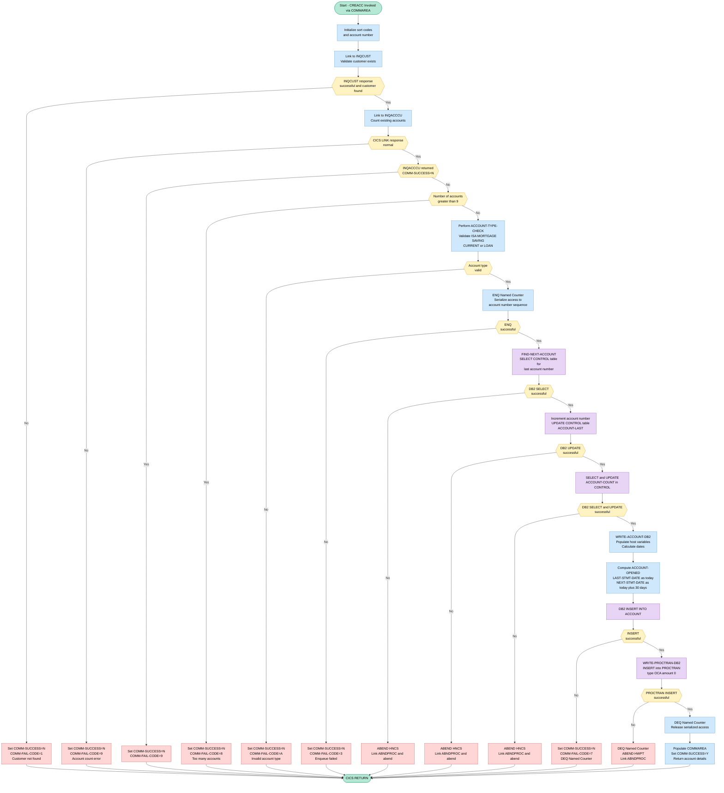
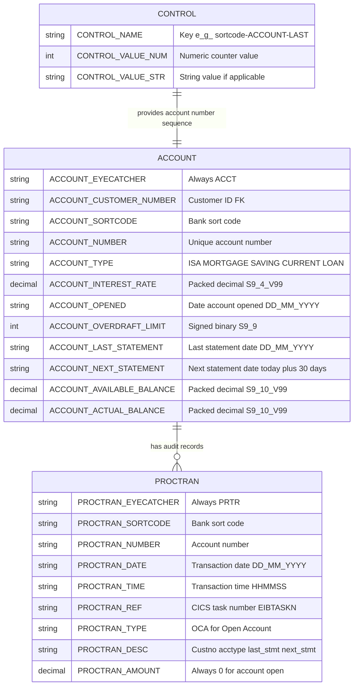

## 1. Purpose

`CREACC` is a CICS-hosted COBOL program responsible for creating new bank accounts on behalf of existing customers within the Bank of Z core banking system. It receives account creation details — including customer number, account type, interest rate, overdraft limit, and opening balances — through the CICS COMMAREA, then validates the request by linking to the `INQCUST` program to confirm the customer exists and to the `INQACCCU` program to ensure the customer holds fewer than 10 accounts and that the requested account type is valid (e.g., ISA, MORTGAGE, SAVING, CURRENT, or LOAN). Upon passing all business rule checks, it serialises access to the account numbering sequence by enqueueing a CICS Named Counter Service (NCS) resource, retrieves and increments the last-used account number from the DB2 CONTROL table, inserts a fully populated new account record — including opening date, last statement date, and a next statement date calculated as today plus 30 days — into the DB2 ACCOUNT table, writes a corresponding processed-transaction audit record to the DB2 PROCTRAN table, and then releases the NCS enqueue before returning the newly assigned account number and a success indicator to the caller; any failure at any stage sets the COMMAREA success flag to `'N'` along with a specific single-character failure code and causes the program to return immediately, with the NCS resource dequeued where appropriate to preserve sequence integrity.

## 2. Inputs

### 2.1 Communication Area (DFHCOMMAREA) — Caller-Supplied Inputs

- **`COMM-CUSTNO`** *(CREACC copybook)*
  The customer number provided by the calling program. Used to validate customer existence via a CICS LINK to `INQCUST`, to pass the customer number to `INQACCCU` for account count retrieval, and to populate the `ACCOUNT_CUSTOMER_NUMBER` column on the DB2 `ACCOUNT` table insert.

- **`COMM-ACC-TYPE`** *(CREACC copybook)*
  The requested account type (e.g., `ISA`, `MORTGAGE`, `SAVING`, `CURRENT`, `LOAN`) supplied by the caller. Validated by the `ACCOUNT-TYPE-CHECK` paragraph and mapped to the `ACCOUNT_TYPE` column of the DB2 `ACCOUNT` table on successful insert.

- **`COMM-INT-RT`** *(CREACC copybook)*
  The interest rate for the new account, provided by the calling program. Moved to the host variable `HV-ACCOUNT-INT-RATE` and inserted into the `ACCOUNT_INTEREST_RATE` column of the DB2 `ACCOUNT` table.

- **`COMM-OVERDR-LIM`** *(CREACC copybook)*
  The overdraft limit for the new account, supplied by the caller. Moved to the host variable `HV-ACCOUNT-OVERDRAFT-LIM` and inserted into the `ACCOUNT_OVERDRAFT_LIMIT` column of the DB2 `ACCOUNT` table.

- **`COMM-AVAIL-BAL`** *(CREACC copybook)*
  The initial available balance for the new account, provided by the caller. Moved to the host variable `HV-ACCOUNT-AVAIL-BAL` and inserted into the `ACCOUNT_AVAILABLE_BALANCE` column of the DB2 `ACCOUNT` table.

- **`COMM-ACT-BAL`** *(CREACC copybook)*
  The initial actual (ledger) balance for the new account, provided by the caller. Moved to the host variable `HV-ACCOUNT-ACTUAL-BAL` and inserted into the `ACCOUNT_ACTUAL_BALANCE` column of the DB2 `ACCOUNT` table.

### 2.2 DB2 External Data Sources

- **`CONTROL` table**
  Queried twice during account number assignment (`FIND-NEXT-ACCOUNT`):
  - Row keyed `<SORTCODE>-ACCOUNT-LAST` — supplies the current highest account number, which is incremented by one to produce the new account number, then written back via `UPDATE`.
  - Row keyed `<SORTCODE>-ACCOUNT-COUNT` — supplies the current total account count, which is incremented and written back via `UPDATE`.

- **`ACCOUNT` table**
  The target of a DB2 `INSERT` in `WRITE-ACCOUNT-DB2`. All column values originate from COMMAREA fields and internally derived values (sort code, account number, dates).

- **`PROCTRAN` table**
  The target of a DB2 `INSERT` in `WRITE-PROCTRAN-DB2`. Records the successfully processed account-creation transaction. All values originate from previously computed or COMMAREA-derived fields.

### 2.3 Linked Programs (CICS LINK — External Program Inputs)

- **`INQCUST` via `INQCUST-COMMAREA`** *(INQCUSTZ copybook)*
  CREACC passes `COMM-CUSTNO` to this program to verify the customer exists. On return, `INQCUST-INQ-SUCCESS` is examined; a non-`'Y'` response aborts account creation with fail code `'1'`.

- **`INQACCCU` via `INQACCCU-COMMAREA`** *(INQACCCU copybook)*
  CREACC passes `COMM-CUSTNO` to this program to retrieve the count of existing accounts held by the customer (`NUMBER-OF-ACCOUNTS`). The count is used to enforce the business rule that a customer may hold no more than 9 accounts simultaneously.

### 2.4 Static / Configuration Inputs

- **`SORTCODE`** *(SORTCODE copybook)*
  The bank's sort code, injected into the program via the `COPY SORTCODE` copybook. Used to construct the Named Counter Service resource name (`NCS-ACC-NO-NAME` = `BANKZACCT` + sort code), to build the DB2 `CONTROL` table lookup keys, and to populate the sort code columns in the `ACCOUNT` and `PROCTRAN` table inserts.

### 2.5 CICS Runtime Inputs

- **CICS date/time** *(via `ASKTIME` / `FORMATTIME`)*
  The current date and time obtained at runtime through `EXEC CICS ASKTIME` and `EXEC CICS FORMATTIME`. The current date is used as the account-opened date and the last-statement date; adding 30 days to it produces the next-statement date (`WS-FUTURE-DATE`) written to both the DB2 `ACCOUNT` table and the COMMAREA return field `COMM-NEXT-STMT-DT`.

## 3. Outputs

### 3.1 Communication Area (COMMAREA) — Returned to Caller

- **`COMM-SUCCESS`** — Primary success/failure flag returned to the calling program. Set to `'Y'` when the account is successfully created and inserted into the DB2 ACCOUNT table; set to `'N'` on any failure condition (invalid customer, invalid account type, too many accounts, enqueue/dequeue failure, or DB2 insert error).
- **`COMM-FAIL-CODE`** — Single-character failure reason code, returned alongside `COMM-SUCCESS = 'N'`:
  - `'1'` — Customer not found (INQCUST validation failed)
  - `'3'` — CICS ENQ (named counter enqueue) failed
  - `'5'` — CICS DEQ (named counter dequeue) failed
  - `'7'` — DB2 INSERT into ACCOUNT table failed
  - `'8'` — Customer already holds more than 9 accounts
  - `'9'` — Account count retrieval via INQACCCU failed
  - `'A'` — Account type is not one of the permitted values (ISA, MORTGAGE, SAVING, CURRENT, LOAN)
- **`COMM-NUMBER`** — The newly assigned account number, populated from `NCS-ACC-NO-VALUE` / `HV-ACCOUNT-ACC-NO` after a successful DB2 insert. Returned to the caller as the identifier of the created account.
- **`COMM-SORTCODE`** — The bank sort code associated with the new account, copied from `HV-ACCOUNT-SORTCODE` after a successful insert.
- **`COMM-EYECATCHER`** — Set to `'ACCT'` on successful account creation, serving as a record-type identifier in the returned COMMAREA.
- **`COMM-OPENED`** — The account opening date (today's date, in DDMMYYYY format), populated from the CICS `FORMATTIME` result and returned to the caller.
- **`COMM-LAST-STMT-DT`** — The last statement date, set to today's date and returned to the caller.
- **`COMM-NEXT-STMT-DT`** — The next statement date, calculated as today's date plus 30 days (leap-year-aware) and returned to the caller.

---

### 3.2 DB2 ACCOUNT Table — Inserted Record

A new row is inserted into the DB2 `ACCOUNT` table on successful account creation. The columns written are:

- **`ACCOUNT_EYECATCHER`** — Fixed value `'ACCT'`, used as a record-type marker.
- **`ACCOUNT_CUSTOMER_NUMBER`** — The customer number from `COMM-CUSTNO`, linking the account to its owner.
- **`ACCOUNT_SORTCODE`** — The bank sort code from `SORTCODE`.
- **`ACCOUNT_NUMBER`** — The newly generated sequential account number derived from `NCS-ACC-NO-VALUE`.
- **`ACCOUNT_TYPE`** — The account type from `COMM-ACC-TYPE` (e.g., ISA, MORTGAGE, SAVING, CURRENT, LOAN).
- **`ACCOUNT_INTEREST_RATE`** — The interest rate from `COMM-INT-RT` (mapped to `HV-ACCOUNT-INT-RATE`).
- **`ACCOUNT_OPENED`** — Today's date, set during `CALCULATE-DATES`.
- **`ACCOUNT_OVERDRAFT_LIMIT`** — The overdraft limit from `COMM-OVERDR-LIM` (mapped to `HV-ACCOUNT-OVERDRAFT-LIM`).
- **`ACCOUNT_LAST_STATEMENT`** — Today's date, set equal to the opened date during `CALCULATE-DATES`.
- **`ACCOUNT_NEXT_STATEMENT`** — Today's date plus 30 days, computed in `CALCULATE-DATES` and `WRITE-ACCOUNT-DB2`.
- **`ACCOUNT_AVAILABLE_BALANCE`** — The available balance from `COMM-AVAIL-BAL` (mapped to `HV-ACCOUNT-AVAIL-BAL`).
- **`ACCOUNT_ACTUAL_BALANCE`** — The actual (ledger) balance from `COMM-ACT-BAL` (mapped to `HV-ACCOUNT-ACTUAL-BAL`).

---

### 3.3 DB2 CONTROL Table — Updated Records

Two rows in the DB2 `CONTROL` table are updated as part of account number sequencing:

- **`<SORTCODE>-ACCOUNT-LAST`** (`CONTROL_VALUE_NUM`) — Incremented by 1 to reflect the last assigned account number. This updated value becomes the new account number.
- **`<SORTCODE>-ACCOUNT-COUNT`** (`CONTROL_VALUE_NUM`) — Incremented by 1 to track the total number of accounts held at the bank.

---

### 3.4 DB2 PROCTRAN Table — Inserted Record

A processed-transaction audit record is inserted into the DB2 `PROCTRAN` table after a successful account insert. The columns written are:

- **`PROCTRAN_EYECATCHER`** — Fixed value `'PRTR'`.
- **`PROCTRAN_SORTCODE`** — The bank sort code.
- **`PROCTRAN_NUMBER`** — The newly created account number (`STORED-ACCNO`).
- **`PROCTRAN_DATE`** — The current date at the time of writing, from CICS `FORMATTIME`.
- **`PROCTRAN_TIME`** — The current time at the time of writing, from CICS `FORMATTIME`.
- **`PROCTRAN_REF`** — The CICS task number (`EIBTASKN`), used as the transaction reference.
- **`PROCTRAN_TYPE`** — Fixed value `'OCA'` (Open Current Account), identifying the transaction type.
- **`PROCTRAN_DESC`** — A 40-character composite field containing: customer number (1–10), account type (11–18), last statement date (19–26), and next statement date (27–34).
- **`PROCTRAN_AMOUNT`** — Set to zero, as no monetary movement occurs on account opening.

---

### 3.5 CICS Abend Handler (ABNDPROC) — Linked on Fatal Errors

If a DB2 SELECT or UPDATE against the `CONTROL` table fails, or if the PROCTRAN INSERT fails, the program calls the `ABNDPROC` abend-handler program via `EXEC CICS LINK` before issuing `EXEC CICS ABEND`. The `ABNDINFO-REC` commarea passed to `ABNDPROC` contains:

- **`ABND-CODE`** — Abend code identifying the failure point (`'HNCS'` for CONTROL table errors, `'HWPT'` for PROCTRAN errors).
- **`ABND-FREEFORM`** — A descriptive free-form message identifying the failing paragraph and the nature of the DB2 error.
- **`ABND-SQLCODE`** — The DB2 SQLCODE at the time of failure.
- **`ABND-RESPCODE` / `ABND-RESP2CODE`** — The CICS EIBRESP and EIBRESP2 values at the time of failure.
- **`ABND-APPLID`, `ABND-TASKNO-KEY`, `ABND-TRANID`, `ABND-DATE`, `ABND-TIME`, `ABND-UTIME-KEY`, `ABND-PROGRAM`** — Supplemental diagnostic context (application ID, task number, transaction ID, date/time, and program name).

---

### 3.6 Console / CICS DISPLAY Messages

Diagnostic messages written to the CICS console/log throughout execution:

- **Program start and input echo** — `'CREACC: Starting account creation'` and the incoming customer number.
- **INQCUST linkage** — Before and after the CICS LINK to INQCUST, including the returned RESP code and `INQCUST-INQ-SUCCESS` flag.
- **Account count** — Before and after INQACCCU linkage, including the returned RESP code and number of accounts; also `'CREACC: Customer has too many accounts (>9)'` when the limit is exceeded, and `'Error counting accounts'` on failure.
- **Account type check** — Before and after `ACCOUNT-TYPE-CHECK`, including the resulting `COMM-SUCCESS` value.
- **Named counter operations** — `'CREACC: Enqueuing named counter'` and `'CREACC: Named counter enqueued successfully'`.
- **CONTROL table access** — SQL SELECT and UPDATE SQLCODE values for both `ACCOUNT-LAST` and `ACCOUNT-COUNT` control rows, as well as current and new counter values.
- **Account write** — `'CREACC: Writing account to DB2'` and `'CREACC: Account creation completed successfully'`.
- **PROCTRAN write failure** — `'In CREACC (WPD010) UNABLE TO WRITE TO PROCTRAN ROW DATASTORE'` including RESP codes and the full `HOST-PROCTRAN-ROW` contents.
- **Fatal abend messages** — `'CREACC - ACCOUNT NCS <name> CANNOT BE ACCESSED AND DB2 SELECT/UPDATE FAILED. SQLCODE=<code>'` prior to issuing `EXEC CICS ABEND`.

## 4. Business Rules

**Program:** CREACC

**Total Rules Extracted:** 19

### 4.1 Paragraph: PREMIERE_P010

#### 4.1.1 Customer Existence Validation via INQCUST

**Purpose:** Validates that the customer specified in the communication area actually exists by checking the result of the INQCUST link call. If the customer cannot be found or the link fails, the account creation is rejected with failure code '1' and processing is terminated.

**Core Decision Logic:**
- If INQCUST link fails or customer is not found (INQCUST-INQ-SUCCESS ≠ 'Y'), set COMM-SUCCESS to 'N' and COMM-FAIL-CODE to '1'
- Account creation is blocked for non-existent or unresolvable customers

**Code:**
```cobol
           IF EIBRESP IS NOT EQUAL TO DFHRESP(NORMAL)
              OR INQCUST-INQ-SUCCESS IS NOT EQUAL TO 'Y'

              MOVE 'N' TO COMM-SUCCESS IN DFHCOMMAREA
              MOVE '1' TO COMM-FAIL-CODE IN DFHCOMMAREA

              PERFORM GET-ME-OUT-OF-HERE

           END-IF
```

#### 4.1.2 Account Count Error Handling — CICS Response Failure

**Purpose:** Enforces that account creation cannot proceed if the CICS call to retrieve the customer's existing account count fails at the infrastructure level. A failure code of '9' is assigned and processing is terminated.

**Core Decision Logic:**
- If the CICS response from INQACCCU is not normal, set COMM-SUCCESS to 'N' and COMM-FAIL-CODE to '9'
- Account creation is blocked when the account count cannot be reliably determined

**Code:**
```cobol
           IF WS-CICS-RESP IS NOT EQUAL TO DFHRESP(NORMAL)
              DISPLAY 'CREACC: Error counting accounts'
              MOVE 'N' TO COMM-SUCCESS IN DFHCOMMAREA
              MOVE 'N' TO COMM-SUCCESS IN INQACCCU-COMMAREA
              MOVE '9' TO COMM-FAIL-CODE IN DFHCOMMAREA

              PERFORM GET-ME-OUT-OF-HERE
           END-IF
```

#### 4.1.3 Account Count Error Handling — INQACCCU Business Failure

**Purpose:** Enforces that account creation cannot proceed if the INQACCCU program itself reports a business-level failure when retrieving the customer's account count. A failure code of '9' is assigned and processing is terminated.

**Core Decision Logic:**
- If INQACCCU returns COMM-SUCCESS = 'N', set COMM-SUCCESS to 'N' and COMM-FAIL-CODE to '9'
- Account creation is blocked when the downstream program cannot successfully return an account count

**Code:**
```cobol
           IF COMM-SUCCESS IN INQACCCU-COMMAREA = 'N'
              DISPLAY 'Error counting accounts'
              MOVE 'N' TO COMM-SUCCESS IN DFHCOMMAREA
              MOVE '9' TO COMM-FAIL-CODE IN DFHCOMMAREA

              PERFORM GET-ME-OUT-OF-HERE
           END-IF
```

#### 4.1.4 Maximum Account Limit Enforcement

**Purpose:** Enforces the business rule that a single customer may not hold more than 9 bank accounts simultaneously. If the customer already has more than 9 accounts, the new account creation is rejected with failure code '8'.

**Core Decision Logic:**
- A customer is not permitted to hold more than 9 accounts at any one time
- If NUMBER-OF-ACCOUNTS exceeds 9, set COMM-SUCCESS to 'N' and COMM-FAIL-CODE to '8'

**Code:**
```cobol
           IF NUMBER-OF-ACCOUNTS IN INQACCCU-COMMAREA > 9
              DISPLAY 'CREACC: Customer has too many accounts (>9)'
              MOVE 'N' TO COMM-SUCCESS IN DFHCOMMAREA
              MOVE '8' TO COMM-FAIL-CODE IN DFHCOMMAREA

              PERFORM GET-ME-OUT-OF-HERE
           END-IF
```

#### 4.1.5 Account Type Validation Gate

**Purpose:** Validates that the requested account type (e.g., ISA, MORTGAGE, SAVING, CURRENT, LOAN) is a permitted value before allowing account creation to proceed. If the account type is invalid, processing is terminated.

**Core Decision Logic:**
- Only recognised account types are permitted for new account creation
- If ACCOUNT-TYPE-CHECK sets COMM-SUCCESS to 'N', account creation is blocked immediately

**Code:**
```cobol
           PERFORM ACCOUNT-TYPE-CHECK

           DISPLAY 'CREACC: Account type check result='
                   COMM-SUCCESS OF DFHCOMMAREA

           IF COMM-SUCCESS OF DFHCOMMAREA = 'N'
              PERFORM GET-ME-OUT-OF-HERE
           END-IF
```

### 4.2 Paragraph: WRITE-ACCOUNT-DB2_WAD010

#### 4.2.1 Next Statement Date Calculation (Today + 30 Days)

**Purpose:** Applies the business rule that the next statement date for a newly created account is set to exactly 30 days from today. The calculated future date is broken into year, month, and day components and stored in the account host variable for DB2 insert.

**Core Decision Logic:**
- The next statement date for a new account is always set to the account opening date plus 30 days
- The future date is decomposed into year, month, and day components for storage in the DB2 ACCOUNT record

**Code:**
```cobol
      *
      *    Add 30 days to the date
      *
           COMPUTE WS-INTEGER = WS-INTEGER + 30.

      *
      *    Convert integer date back to a Gregorian date (YYYYMMDD)
      *
           COMPUTE WS-FUTURE-DATE =
              FUNCTION DATE-OF-INTEGER(WS-INTEGER).

      *
      *    Store the answer back in the  Next Statement Date
      *
           MOVE WS-FUTURE-DATE TO WS-FUT-9.
           MOVE WS-FUT-X-YY TO HV-ACCOUNT-NEXT-STMT-YEAR.
           MOVE '.' TO HV-ACCOUNT-NEXT-STMT-DELIM2.
           MOVE WS-FUT-X-MM TO HV-ACCOUNT-NEXT-STMT-MONTH.
           MOVE '.' TO HV-ACCOUNT-NEXT-STMT-DELIM1.
           MOVE WS-FUT-X-DD TO HV-ACCOUNT-NEXT-STMT-DAY.
```

#### 4.2.2 New Account DB2 Insert

**Purpose:** Creates a new bank account domain record in the DB2 ACCOUNT table, capturing all core account attributes including the customer number, sort code, account number, account type, interest rate, overdraft limit, opening date, statement dates, and balances. This is the primary business event of the account creation process.

**Core Decision Logic:**
- A new account record is permanently established in the ACCOUNT table with all financial and customer attributes
- Account type, interest rate, overdraft limit, and opening balances supplied via the communication area are written as the authoritative account terms

**Code:**
```cobol
           EXEC SQL
              INSERT INTO ACCOUNT
                     (ACCOUNT_EYECATCHER,
                      ACCOUNT_CUSTOMER_NUMBER,
                      ACCOUNT_SORTCODE,
                      ACCOUNT_NUMBER,
                      ACCOUNT_TYPE,
                      ACCOUNT_INTEREST_RATE,
                      ACCOUNT_OPENED,
                      ACCOUNT_OVERDRAFT_LIMIT,
                      ACCOUNT_LAST_STATEMENT,
                      ACCOUNT_NEXT_STATEMENT,
                      ACCOUNT_AVAILABLE_BALANCE,
                      ACCOUNT_ACTUAL_BALANCE
                      )
              VALUES(:HV-ACCOUNT-EYECATCHER,
                      :HV-ACCOUNT-CUST-NO,
                      :HV-ACCOUNT-SORTCODE,
                      :HV-ACCOUNT-ACC-NO,
                      :HV-ACCOUNT-ACC-TYPE,
                      :HV-ACCOUNT-INT-RATE,
                      :HV-ACCOUNT-OPENED,
                      :HV-ACCOUNT-OVERDRAFT-LIM,
                      :HV-ACCOUNT-LAST-STMT,
                      :HV-ACCOUNT-NEXT-STMT,
                      :HV-ACCOUNT-AVAIL-BAL,
                      :HV-ACCOUNT-ACTUAL-BAL
                     )
           END-EXEC.
```

#### 4.2.3 DB2 Insert Failure — Account Creation Rejection

**Purpose:** Enforces that if the DB2 INSERT into the ACCOUNT table fails, the account creation is immediately rejected with failure code '7', the named counter enqueue lock is released, and processing is terminated. This prevents partial or inconsistent account state.

**Core Decision Logic:**
- A non-zero SQLCODE from the ACCOUNT INSERT results in account creation failure with COMM-FAIL-CODE '7'
- The named counter resource lock (ENQ) must be released (DEQ) even on INSERT failure to avoid deadlocks

**Code:**
```cobol
           IF SQLCODE NOT = 0
              MOVE SQLCODE TO SQLCODE-DISPLAY
              MOVE 'N' TO COMM-SUCCESS IN DFHCOMMAREA
              MOVE '7' TO COMM-FAIL-CODE IN DFHCOMMAREA
              PERFORM DEQ-NAMED-COUNTER
              MOVE SQLCODE TO SQLCODE-DISPLAY

              PERFORM GET-ME-OUT-OF-HERE
           END-IF.
```

#### 4.2.4 Processed Transaction (PROCTRAN) Write on Successful Account Creation

**Purpose:** Records the account creation as a processed transaction (PROCTRAN) event by capturing the sort code, account number, customer number, account type, and statement dates, then writing the transaction record. This creates an auditable business trail of the account creation event.

**Core Decision Logic:**
- Every successfully created account must generate a corresponding PROCTRAN audit record
- Statement date fields are reformatted from DB2 format before being stored in the PROCTRAN record

**Code:**
```cobol
           MOVE HV-ACCOUNT-SORTCODE TO STORED-SORTCODE.
           MOVE HV-ACCOUNT-ACC-NO TO STORED-ACCNO.
           MOVE HV-ACCOUNT-CUST-NO TO STORED-CUSTNO.
           MOVE HV-ACCOUNT-ACC-TYPE TO STORED-ACCTYPE.
           MOVE HV-ACCOUNT-LAST-STMT(1:2) TO STORED-LST-STMT(1:2).
           MOVE HV-ACCOUNT-LAST-STMT(4:2) TO STORED-LST-STMT(3:2).
           MOVE HV-ACCOUNT-LAST-STMT(7:4) TO STORED-LST-STMT(5:4).
           MOVE HV-ACCOUNT-NEXT-STMT(1:2) TO STORED-NXT-STMT(1:2).
           MOVE HV-ACCOUNT-NEXT-STMT(4:2) TO STORED-NXT-STMT(3:2).
           MOVE HV-ACCOUNT-NEXT-STMT(7:4) TO STORED-NXT-STMT(5:4).

           PERFORM WRITE-PROCTRAN.
```

#### 4.2.5 Successful Account Creation — Communication Area Population

**Purpose:** Upon successful account creation, populates the communication area with the newly assigned account number, sort code, account opening date, last statement date, and next statement date, and sets the success indicator to 'Y' with a blank failure code. This communicates the confirmed new account details back to the calling program.

**Core Decision Logic:**
- COMM-SUCCESS is set to 'Y' only after a fully successful account creation including DB2 insert and PROCTRAN write
- The assigned account number, sort code, and all date fields are returned to the caller via the communication area
- COMM-FAIL-CODE is cleared to blank on success to signal no error condition

**Code:**
```cobol
           MOVE HV-ACCOUNT-SORTCODE TO COMM-SORTCODE.
           MOVE HV-ACCOUNT-ACC-NO TO COMM-NUMBER.

           MOVE HV-ACCOUNT-OPENED-DAY(1:2)
              TO COMM-OPENED IN DFHCOMMAREA(1:2).
           MOVE HV-ACCOUNT-OPENED-MONTH(1:2)
              TO COMM-OPENED IN DFHCOMMAREA(3:2).
           MOVE HV-ACCOUNT-OPENED-YEAR(1:4)
              TO COMM-OPENED IN DFHCOMMAREA(5:4).
           MOVE HV-ACCOUNT-LAST-STMT-DAY(1:2)
              TO COMM-LAST-STMT-DT IN DFHCOMMAREA(1:2).
           MOVE HV-ACCOUNT-LAST-STMT-MONTH(1:2)
              TO COMM-LAST-STMT-DT IN DFHCOMMAREA(3:2).
           MOVE HV-ACCOUNT-LAST-STMT-YEAR(1:4)
              TO COMM-LAST-STMT-DT IN DFHCOMMAREA(5:4).
           MOVE HV-ACCOUNT-NEXT-STMT-DAY(1:2)
              TO COMM-NEXT-STMT-DT IN DFHCOMMAREA(1:2).
           MOVE HV-ACCOUNT-NEXT-STMT-MONTH(1:2)
              TO COMM-NEXT-STMT-DT IN DFHCOMMAREA(3:2).
           MOVE HV-ACCOUNT-NEXT-STMT-YEAR(1:4)
              TO COMM-NEXT-STMT-DT IN DFHCOMMAREA(5:4).

           MOVE 'ACCT' TO COMM-EYECATCHER.
           MOVE 'Y' TO COMM-SUCCESS IN DFHCOMMAREA.
           MOVE ' ' TO COMM-FAIL-CODE IN DFHCOMMAREA.
```

### 4.3 Paragraph: ENQ-NAMED-COUNTER_ENC010

#### 4.3.1 Named Counter Enqueue Failure — Account Creation Rejection

**Purpose:** Enforces that account creation cannot proceed if the CICS ENQ on the Named Counter Service resource (which serialises account number assignment) fails. The creation is rejected with failure code '3' to prevent duplicate or corrupt account number generation.

**Core Decision Logic:**
- If the ENQ on the account number Named Counter resource fails, account creation is rejected with COMM-FAIL-CODE '3'
- Exclusive access to the account number counter must be obtained before any account number can be assigned

**Code:**
```cobol
           IF WS-CICS-RESP NOT = DFHRESP(NORMAL)
              MOVE 'N' TO COMM-SUCCESS IN DFHCOMMAREA
              MOVE '3' TO COMM-FAIL-CODE IN DFHCOMMAREA
              PERFORM GET-ME-OUT-OF-HERE
           END-IF.
```

### 4.4 Paragraph: DEQ-NAMED-COUNTER_DNC010

#### 4.4.1 Named Counter Dequeue Failure — Account Creation Rejection

**Purpose:** Enforces that if the CICS DEQ on the Named Counter Service resource fails after account processing, the account creation is marked as failed with failure code '5' and processing is terminated. This ensures the counter lock status is accurately reported and does not silently remain held.

**Core Decision Logic:**
- If the DEQ on the account number Named Counter resource fails, COMM-SUCCESS is set to 'N' and COMM-FAIL-CODE to '5'
- Failure to release the named counter lock is treated as a business-level account creation failure

**Code:**
```cobol
           IF WS-CICS-RESP NOT = DFHRESP(NORMAL)
              MOVE 'N' TO COMM-SUCCESS IN DFHCOMMAREA
              MOVE '5' TO COMM-FAIL-CODE IN DFHCOMMAREA
              PERFORM GET-ME-OUT-OF-HERE
           END-IF.
```

### 4.5 Paragraph: FIND-NEXT-ACCOUNT_FNA010

#### 4.5.1 Next Sequential Account Number Assignment and CONTROL Table Update

**Purpose:** Derives the next sequential bank account number by incrementing the last used account number retrieved from the DB2 CONTROL table by 1, then immediately updates the CONTROL table with the new last-used value to maintain the account number sequence for future assignments.

**Core Decision Logic:**
- Account numbers are assigned sequentially by incrementing the last known account number by 1
- The CONTROL table is updated immediately to reserve the new account number and prevent duplicate assignment

**Code:**
```cobol
           ELSE
              DISPLAY 'CREACC: SELECT successful, current value='
                      HV-CONTROL-VALUE-NUM
              ADD 1 TO HV-CONTROL-VALUE-NUM GIVING
                 COMM-NUMBER
                 ACCOUNT-NUMBER
                 REQUIRED-ACCT-NUMBER3
                 NCS-ACC-NO-VALUE
                 HV-CONTROL-VALUE-NUM

              DISPLAY 'CREACC: New account number will be='
                      ACCOUNT-NUMBER
              DISPLAY 'CREACC: Updating CONTROL table'

             EXEC SQL
               UPDATE CONTROL
               SET CONTROL_VALUE_NUM = :HV-CONTROL-VALUE-NUM
               WHERE (CONTROL_NAME = :HV-CONTROL-NAME)
             END-EXEC
```

#### 4.5.2 Account Count Increment in CONTROL Table

**Purpose:** Increments the bank-wide account count in the DB2 CONTROL table by 1 to reflect the addition of a new account, maintaining an accurate running total of all accounts held at the bank.

**Core Decision Logic:**
- The global account count maintained in the CONTROL table must be incremented by 1 for each successfully assigned account number
- The updated account count is persisted immediately to the CONTROL table

**Code:**
```cobol
           ELSE
              DISPLAY 'CREACC: ACCOUNT-COUNT current value='
                      HV-CONTROL-VALUE-NUM
              ADD 1 TO HV-CONTROL-VALUE-NUM GIVING
                 HV-CONTROL-VALUE-NUM

              DISPLAY 'CREACC: Updating ACCOUNT-COUNT to='
                      HV-CONTROL-VALUE-NUM

             EXEC SQL
               UPDATE CONTROL
               SET CONTROL_VALUE_NUM = :HV-CONTROL-VALUE-NUM
               WHERE (CONTROL_NAME = :HV-CONTROL-NAME)
             END-EXEC
```

### 4.6 Paragraph: WRITE-PROCTRAN_WP010

#### 4.6.1 Trigger Processed Transaction Write

**Purpose:** Initiates the writing of a successfully processed account creation transaction to the PROCTRAN audit table, ensuring a permanent domain record of the account opening event is created.

**Core Decision Logic:**
- Every successful account creation must produce a corresponding processed transaction record in PROCTRAN.

**Code:**
```cobol
           PERFORM WRITE-PROCTRAN-DB2.
```

### 4.7 Paragraph: WRITE-PROCTRAN-DB2_WPD010

#### 4.7.1 Insert Account Creation Transaction into PROCTRAN

**Purpose:** Records the successful account creation as a permanent auditable transaction in the PROCTRAN table. The record captures the bank sort code, newly created account number, customer number, account type, statement dates, transaction type ('OCA' — Open Current Account), a zero monetary amount, and the exact timestamp of the event, creating a full domain audit trail of the account opening.

**Core Decision Logic:**
- Every successfully created account must generate a corresponding PROCTRAN audit record.
- The transaction type is set to 'OCA' (Open Account) to classify the event in the processed transaction history.
- The transaction amount is recorded as zero, reflecting that account creation itself carries no monetary movement.
- The PROCTRAN description embeds customer number, account type, last statement date, and next statement date as contextual business data for the audit record.
- The sort code and account number are stamped onto the record to uniquely identify the domain entity associated with this event.

**Code:**
```cobol
           MOVE 'PRTR' TO HV-PROCTRAN-EYECATCHER.
           MOVE SORTCODE TO HV-PROCTRAN-SORT-CODE.
           MOVE STORED-ACCNO TO HV-PROCTRAN-ACC-NUMBER.
           MOVE EIBTASKN TO WS-EIBTASKN12.
           MOVE WS-EIBTASKN12 TO HV-PROCTRAN-REF.

      *
      *    Populate the time and date
      *
           EXEC CICS ASKTIME
                ABSTIME(WS-U-TIME)
                END-EXEC.

           EXEC CICS FORMATTIME
                ABSTIME(WS-U-TIME)
                DDMMYYYY(WS-ORIG-DATE)
                TIME(HV-PROCTRAN-TIME)
                DATESEP('.')
                END-EXEC.

           MOVE WS-ORIG-DATE TO WS-ORIG-DATE-GRP-X.
           MOVE WS-ORIG-DATE-GRP-X TO HV-PROCTRAN-DATE.

           MOVE STORED-CUSTNO TO HV-PROCTRAN-DESC(1:10).
           MOVE STORED-ACCTYPE TO HV-PROCTRAN-DESC(11:8).
           MOVE STORED-LST-STMT TO HV-PROCTRAN-DESC(19:8).
           MOVE STORED-NXT-STMT TO HV-PROCTRAN-DESC(27:8).
           MOVE SPACES TO HV-PROCTRAN-DESC(35:6).

           MOVE 'OCA' TO HV-PROCTRAN-TYPE.
           MOVE 0 TO HV-PROCTRAN-AMOUNT.

           EXEC SQL
              INSERT INTO PROCTRAN
                     (
                      PROCTRAN_EYECATCHER,
                      PROCTRAN_SORTCODE,
                      PROCTRAN_NUMBER,
                      PROCTRAN_DATE,
                      PROCTRAN_TIME,
                      PROCTRAN_REF,
                      PROCTRAN_TYPE,
                      PROCTRAN_DESC,
                      PROCTRAN_AMOUNT
                     )
              VALUES
                     (
                      :HV-PROCTRAN-EYECATCHER,
                      :HV-PROCTRAN-SORT-CODE,
                      :HV-PROCTRAN-ACC-NUMBER,
                      :HV-PROCTRAN-DATE,
                      :HV-PROCTRAN-TIME,
                      :HV-PROCTRAN-REF,
                      :HV-PROCTRAN-TYPE,
                      :HV-PROCTRAN-DESC,
                      :HV-PROCTRAN-AMOUNT
                     )
           END-EXEC.
```

### 4.8 Paragraph: CUSTOMER-ACCOUNT-COUNT_CAC010

#### 4.8.1 Retrieve Existing Account Count for Customer

**Purpose:** Invokes the INQACCCU program to retrieve the current number of accounts held by the customer identified in COMM-CUSTNO. The result (NUMBER-OF-ACCOUNTS) is subsequently used to enforce the business rule that a customer may not hold more than 9 accounts. A maximum of 20 accounts is passed as the retrieval limit to the inquiry program.

**Core Decision Logic:**
- The customer's existing account count must be retrieved before a new account can be created, to enforce the maximum account limit policy.
- Up to 20 accounts are requested from INQACCCU to ensure the full picture of the customer's account portfolio is available for the limit check.

**Code:**
```cobol
           MOVE 20 TO NUMBER-OF-ACCOUNTS IN INQACCCU-COMMAREA.
           MOVE COMM-CUSTNO IN DFHCOMMAREA
              TO CUSTOMER-NUMBER IN INQACCCU-COMMAREA.

           SET COMM-PCB-POINTER TO NULL

           EXEC CICS LINK PROGRAM('INQACCCU')
                COMMAREA(INQACCCU-COMMAREA)
                RESP(WS-CICS-RESP)
                SYNCONRETURN
                END-EXEC.
```

### 4.9 Paragraph: CALCULATE-DATES_CD010

#### 4.9.1 Calculate Account Opened, Last Statement, and Next Statement Dates

**Purpose:** Determines and assigns all three key account date fields for a newly created account. Today's date becomes both the Account Opened date and the Last Statement Date. The Next Statement Date is calculated by adding 30 days to today (or 28/29 days in February with full leap year logic), producing the date of the first upcoming account statement. All dates are formatted and populated into the account record and DB2 host variables.

**Core Decision Logic:**
- The account opened date is set to today's date at the time of account creation.
- The last statement date is set equal to the account opened date, reflecting no prior statements exist.
- The next statement date is calculated as today plus 30 days for all months except February.
- For February, the next statement date adds 28 days, with an extra day added if the year is a leap year (divisible by 4, except centuries unless divisible by 400).
- Full Gregorian leap year rules are applied: divisible by 4 is a leap year, except centuries, which must be divisible by 400.

**Code:**
```cobol
           EVALUATE WS-ORIG-DATE-MM
           WHEN 1
           WHEN 3
           WHEN 5
           WHEN 7
           WHEN 8
           WHEN 10
           WHEN 12
                COMPUTE WS-INTEGER = WS-INTEGER + 30
           WHEN 9
           WHEN 4
           WHEN 6
           WHEN 11
                COMPUTE WS-INTEGER = WS-INTEGER + 30
           WHEN 2
                COMPUTE WS-INTEGER = WS-INTEGER + 28
                DIVIDE WS-ORIG-DATE-YYYY BY 4 GIVING DONT-CARE
                   REMAINDER LEAP-YEAR

                IF LEAP-YEAR = ZERO
                   DIVIDE WS-ORIG-DATE-YYYY BY 100 GIVING DONT-CARE
                      REMAINDER LEAP-YEAR

                   IF LEAP-YEAR > 0
                      ADD 1 TO WS-INTEGER GIVING WS-INTEGER
                   ELSE
                      DIVIDE WS-ORIG-DATE-YYYY BY 400 GIVING DONT-CARE
                         REMAINDER LEAP-YEAR
                      IF LEAP-YEAR = ZERO
                         ADD 1 TO WS-INTEGER GIVING WS-INTEGER
                      END-IF
                   END-IF
                END-IF

           END-EVALUATE.


      *
      *    Convert integer date back to a Gregorian date (YYYYMMDD)
      *
           COMPUTE WS-FUTURE-DATE =
              FUNCTION DATE-OF-INTEGER(WS-INTEGER).

      *
      *    Store the answer back in the Next Statement Date
      *

           MOVE WS-FUTURE-DATE(1:4) TO ACCOUNT-NEXT-STMT-DATE(5:4).
           MOVE WS-FUTURE-DATE(5:2) TO ACCOUNT-NEXT-STMT-DATE(3:2).
           MOVE WS-FUTURE-DATE(7:2) TO ACCOUNT-NEXT-STMT-DATE(1:2).

           MOVE WS-ORIG-DATE-DD TO ACCOUNT-OPENED(1:2).
           MOVE WS-ORIG-DATE-MM TO ACCOUNT-OPENED(3:2).
           MOVE WS-ORIG-DATE-YYYY TO ACCOUNT-OPENED(5:4).
           MOVE ACCOUNT-OPENED TO ACCOUNT-LAST-STMT-DATE.

           MOVE WS-ORIG-DATE-DD TO HV-ACCOUNT-OPENED-DAY.
           MOVE '.' TO HV-ACCOUNT-OPENED-DELIM1.
           MOVE WS-ORIG-DATE-MM TO HV-ACCOUNT-OPENED-MONTH.
           MOVE '.' TO HV-ACCOUNT-OPENED-DELIM2.
           MOVE WS-ORIG-DATE-YYYY TO HV-ACCOUNT-OPENED-YEAR.

           MOVE WS-ORIG-DATE-DD TO HV-ACCOUNT-LAST-STMT-DAY.
           MOVE '.' TO HV-ACCOUNT-LAST-STMT-DELIM1.
           MOVE WS-ORIG-DATE-MM TO HV-ACCOUNT-LAST-STMT-MONTH.
           MOVE '.' TO HV-ACCOUNT-LAST-STMT-DELIM2.
           MOVE WS-ORIG-DATE-YYYY TO HV-ACCOUNT-LAST-STMT-YEAR.
```

### 4.10 Paragraph: ACCOUNT-TYPE-CHECK_ATC010

#### 4.10.1 Validate Account Type Against Permitted Values

**Purpose:** Enforces the business rule that only the five permitted account types — ISA, MORTGAGE, SAVING, CURRENT, and LOAN — are valid for new account creation. If the requested account type matches one of these values, the success flag is set to 'Y'. Any other account type is rejected by setting the success flag to 'N' and the failure code to 'A', preventing the account from being created.

**Core Decision Logic:**
- Only ISA, MORTGAGE, SAVING, CURRENT, and LOAN are valid account types for account creation.
- Any account type not in the permitted list is rejected with failure code 'A'.
- A valid account type sets COMM-SUCCESS to 'Y', enabling the account creation process to proceed.
- An invalid account type sets COMM-SUCCESS to 'N', halting the account creation process.

**Code:**
```cobol
           EVALUATE TRUE
           WHEN COMM-ACC-TYPE IN DFHCOMMAREA(1:3) = 'ISA'
           WHEN COMM-ACC-TYPE IN DFHCOMMAREA(1:8) = 'MORTGAGE'
           WHEN COMM-ACC-TYPE IN DFHCOMMAREA(1:6) = 'SAVING'
           WHEN COMM-ACC-TYPE IN DFHCOMMAREA(1:7) = 'CURRENT'
           WHEN COMM-ACC-TYPE IN DFHCOMMAREA(1:4) = 'LOAN'
                MOVE 'Y' TO COMM-SUCCESS OF DFHCOMMAREA
           WHEN OTHER
                MOVE 'N' TO COMM-SUCCESS OF DFHCOMMAREA
                MOVE 'A' TO COMM-FAIL-CODE IN DFHCOMMAREA
           END-EVALUATE.
```


## 5. Processing logic

### 5.1 Mermaid Flow Diagram



---

### 5.2 Processing Logic Description

#### 5.2.1 High-level Summary

**CREACC** is a CICS/DB2 COBOL program that creates a new bank account for an existing customer. It enforces a series of business rules — customer validation, account count ceiling, account type whitelisting — before serialising account number assignment via a CICS ENQ/DEQ mechanism, persisting the new account to DB2, and recording the creation event in a processed-transaction audit table. The entire result (success/failure and new account details) is communicated back through a shared COMMAREA structure.

---

#### 5.2.2 Execution Flow

**Step 1 – Initialisation**
The program begins in the `PREMIERE` section. It copies the bank's sort code into the local working-storage keys, zeros the `ACCOUNT-NUMBER` field, and initialises the `INQCUST-COMMAREA` before any external calls are made.

---

**Step 2 – Customer Existence Validation**
`COMM-CUSTNO` from the COMMAREA is moved into `INQCUST-CUSTNO`, and the program issues a `CICS LINK` to **INQCUST**. On return, both `EIBRESP` and `INQCUST-INQ-SUCCESS` are checked.

- If either is abnormal/non-`'Y'`: `COMM-SUCCESS = 'N'`, `COMM-FAIL-CODE = '1'`, and execution immediately terminates via `GET-ME-OUT-OF-HERE` (CICS RETURN).

---

**Step 3 – Account Count Check (CUSTOMER-ACCOUNT-COUNT)**
The program sets `NUMBER-OF-ACCOUNTS` to a sentinel value of 20, then issues a `CICS LINK SYNCONRETURN` to **INQACCCU** to retrieve the actual count of accounts held by the customer.

Three sub-conditions are checked in sequence:

| Condition | Fail Code | Meaning |
|---|---|---|
| CICS RESP not NORMAL | `'9'` | LINK itself failed |
| `COMM-SUCCESS` in INQACCCU-COMMAREA = `'N'` | `'9'` | INQACCCU reported an error |
| `NUMBER-OF-ACCOUNTS > 9` | `'8'` | Customer already holds maximum 9 accounts |

Any failure results in an immediate return with `COMM-SUCCESS = 'N'`.

---

**Step 4 – Account Type Validation (ACCOUNT-TYPE-CHECK)**
`COMM-ACC-TYPE` is validated against an explicit whitelist using an `EVALUATE TRUE` construct:

- **Valid types:** `ISA`, `MORTGAGE`, `SAVING`, `CURRENT`, `LOAN`
- If the type matches any of these, `COMM-SUCCESS = 'Y'` is set.
- Any other value sets `COMM-SUCCESS = 'N'` and `COMM-FAIL-CODE = 'A'`, causing immediate exit.

---

**Step 5 – Serialise Account Number Assignment (ENQ-NAMED-COUNTER)**
The CICS Named Counter resource name is constructed from the literal `'BANKZACCT'` concatenated with the bank's sort code (e.g., `BANKZACCT123456`). A `CICS ENQ` is issued against this 16-byte resource name to prevent concurrent account creation from producing duplicate account numbers.

- If ENQ fails: `COMM-FAIL-CODE = '3'`, immediate exit.

---

**Step 6 – Determine Next Account Number (FIND-NEXT-ACCOUNT)**

This section performs four DB2 operations in sequence:

1. **SELECT from CONTROL** where `CONTROL_NAME = '<sortcode>-ACCOUNT-LAST'` — retrieves the last-assigned account number.
   - Failure → ABEND `HNCS` (after linking to `ABNDPROC` abend handler).
2. **Increment** `HV-CONTROL-VALUE-NUM` by 1 → propagated to `ACCOUNT-NUMBER`, `COMM-NUMBER`, `NCS-ACC-NO-VALUE`.
3. **UPDATE CONTROL** to persist the new last account number.
   - Failure → ABEND `HNCS`.
4. **SELECT from CONTROL** where `CONTROL_NAME = '<sortcode>-ACCOUNT-COUNT'` — retrieves total account count.
   - Failure → ABEND `HNCS`.
5. **Increment** the count by 1 and **UPDATE CONTROL**.
   - Failure → ABEND `HNCS`.

DB2 failures here are treated as fatal — the program calls the `ABNDPROC` abend handler program and issues `EXEC CICS ABEND ABCODE('HNCS')`.

---

**Step 7 – Write Account to DB2 (WRITE-ACCOUNT-DB2)**

All host variables are populated from the COMMAREA and computed values:

- `ACCOUNT_EYECATCHER` = `'ACCT'`
- Customer number, sort code, account number, account type, interest rate, overdraft limit, available balance, actual balance — all sourced from `DFHCOMMAREA`.
- **Date Calculation (CALCULATE-DATES):**
  - `ACCOUNT_OPENED` and `ACCOUNT_LAST_STATEMENT` = today's date (via `CICS ASKTIME` / `FORMATTIME`).
  - `ACCOUNT_NEXT_STATEMENT` = today + 30 days, computed using `INTEGER-OF-DATE` / `DATE-OF-INTEGER` COBOL intrinsic functions. February is handled with leap-year logic (divisible by 4, except centuries unless divisible by 400).
- A `NEXT-STMT` date is independently recalculated in `WRITE-ACCOUNT-DB2` and written to `HV-ACCOUNT-NEXT-STMT`.

An `EXEC SQL INSERT INTO ACCOUNT` is then executed.

- If `SQLCODE ≠ 0`: `COMM-SUCCESS = 'N'`, `COMM-FAIL-CODE = '7'`, **DEQ** the named counter, then exit.

---

**Step 8 – Write Processed Transaction Audit Record (WRITE-PROCTRAN-DB2)**

On a successful account INSERT, an audit row is written to the **PROCTRAN** table:

- `PROCTRAN_EYECATCHER` = `'PRTR'`
- `PROCTRAN_TYPE` = `'OCA'` (Open Current Account — generic for all account opens)
- `PROCTRAN_AMOUNT` = `0`
- `PROCTRAN_DESC` contains a concatenation of: customer number, account type, last statement date, next statement date.
- `PROCTRAN_REF` = `EIBTASKN` (the CICS task number).
- Date and time populated via `CICS ASKTIME` / `FORMATTIME`.

If the PROCTRAN INSERT fails: **DEQ**, link to `ABNDPROC`, then issue `EXEC CICS ABEND ABCODE('HWPT')`.

---

**Step 9 – Release Serialisation and Return**

`DEQ-NAMED-COUNTER` is performed to release the ENQ lock on the account number sequence.

The COMMAREA is then populated with the final account details:
- `COMM-SORTCODE`, `COMM-NUMBER`, `COMM-OPENED`, `COMM-LAST-STMT-DT`, `COMM-NEXT-STMT-DT`
- `COMM-EYECATCHER = 'ACCT'`
- `COMM-SUCCESS = 'Y'`
- `COMM-FAIL-CODE = ' '`

Finally, `GET-ME-OUT-OF-HERE` issues `EXEC CICS RETURN`.

---

#### 5.2.3 External Interactions

| System | Type | Purpose |
|---|---|---|
| **INQCUST** | CICS LINK | Validates that the customer number supplied in the COMMAREA corresponds to an existing customer record |
| **INQACCCU** | CICS LINK (SYNCONRETURN) | Retrieves the count of accounts already held by the customer to enforce the 9-account ceiling |
| **ABNDPROC** | CICS LINK | Abend handler — receives diagnostic information (ABNDINFO-REC) before a fatal CICS ABEND is issued |
| **DB2 CONTROL table** | SQL SELECT + UPDATE | Reads and increments the last-assigned account number (`ACCOUNT-LAST`) and total account count (`ACCOUNT-COUNT`) keyed by sort code |
| **DB2 ACCOUNT table** | SQL INSERT | Persists the new bank account record with all its attributes |
| **DB2 PROCTRAN table** | SQL INSERT | Writes an audit/processed-transaction record of type `OCA` for the account creation event |
| **CICS ENQ / DEQ** | CICS API | Serialises concurrent access to the account number counter using resource name `BANKZACCT<sortcode>` |
| **CICS ASKTIME / FORMATTIME** | CICS API | Retrieves and formats the current date and time for account opened, statement, and audit timestamps |

---

#### 5.2.4 Plain Language Summary

When a bank operator requests the creation of a new account for a customer, **CREACC** acts as the gatekeeper and creator:

1. **Is the customer real?** — It asks the INQCUST program to confirm the customer exists. If not, it refuses immediately.
2. **Does the customer already have too many accounts?** — It asks INQACCCU how many accounts the customer currently holds. If they already have 9, no more can be added.
3. **Is the account type recognised?** — Only ISA, Mortgage, Saving, Current, and Loan accounts are permitted. Anything else is rejected.
4. **Lock the account number counter** — Before assigning a new account number, it places a lock (ENQ) on the counter resource so no two simultaneous requests can get the same number.
5. **Get the next available account number** — It reads the last-used account number from a control table in DB2, adds one to it, and updates the table to record the new last-used number. It also increments the total account count.
6. **Create the account** — It inserts a full account record into the DB2 ACCOUNT table, including today's date as the opened date and today + 30 days as the first statement date.
7. **Write an audit trail** — It records the account creation as a processed transaction (type "OCA") in the PROCTRAN table.
8. **Release the lock** — The ENQ lock is released (DEQ) so other account creations can proceed.
9. **Return the result** — The COMMAREA is updated with the new account number, dates, and a success indicator, and control is returned to the calling application.

If anything fails along the way, the program sets a specific failure code in the COMMAREA and returns immediately. For critical DB2 failures (on the control-table or PROCTRAN operations), the program escalates to a CICS ABEND after calling the central abend handler to capture full diagnostic information.

---

### 5.3 Database Tables



## 6. Paragraphs

### 6.1 P010 — Main Entry Point and Orchestration

- Acts as the primary controller for the account creation workflow, invoked at program entry via `PROCEDURE DIVISION USING DFHCOMMAREA`.
- Initialises key working-storage fields: zeroes `ACCOUNT-NUMBER`, populates sort-code fields (`REQUIRED-SORT-CODE`, `REQUIRED-SORT-CODE2`) from the global `SORTCODE`, and initialises `INQCUST-COMMAREA`.
- **Customer validation:** Moves `COMM-CUSTNO` into the INQCUST communication area and issues a `CICS LINK` to `INQCUST` to confirm the customer exists.
  - If the CICS response is abnormal or `INQCUST-INQ-SUCCESS` is not `'Y'`, sets `COMM-SUCCESS` to `'N'` and `COMM-FAIL-CODE` to `'1'`, then performs `GET-ME-OUT-OF-HERE`.
- **Account count check:** Calls `CUSTOMER-ACCOUNT-COUNT` (which links to `INQACCCU`) to retrieve the number of existing accounts for the customer.
  - If the CICS response is abnormal, sets failure code `'9'` and exits.
  - If `COMM-SUCCESS` in the INQACCCU area is `'N'`, sets failure code `'9'` and exits.
  - If the account count exceeds 9, sets failure code `'8'` and exits — enforcing the maximum-accounts business rule.
- **Account type validation:** Calls `ACCOUNT-TYPE-CHECK` to confirm the requested account type is permitted.
  - If `COMM-SUCCESS` is `'N'` on return, exits immediately.
- **Account number reservation:** Calls `ENQ-NAMED-COUNTER` to serialize access to the account number counter via a CICS ENQ.
- **Account number assignment and persistence:** Calls `FIND-NEXT-ACCOUNT` to derive and persist the next sequential account number.
- **Account record writing:** Calls `WRITE-ACCOUNT-DB2` to perform the DB2 INSERT to the ACCOUNT table and write a PROCTRAN entry.
- Terminates by performing `GET-ME-OUT-OF-HERE` to issue `CICS RETURN`.

---

### 6.2 ENQ-NAMED-COUNTER — Enqueue Named Counter Resource

- Serialises concurrent access to the account number sequence by acquiring an exclusive CICS enqueue on the Named Counter Service (NCS) resource.
- Moves the bank `SORTCODE` into `NCS-ACC-NO-TEST-SORT` to form the full resource name (`NCS-ACC-NO-NAME`, constructed as `'BANKZACCT' + SORTCODE`).
- Issues `EXEC CICS ENQ RESOURCE(NCS-ACC-NO-NAME) LENGTH(16)`, capturing the response in `WS-CICS-RESP` and `WS-CICS-RESP2`.
- If the ENQ fails (response not `DFHRESP(NORMAL)`), sets `COMM-SUCCESS` to `'N'`, `COMM-FAIL-CODE` to `'3'`, and performs `GET-ME-OUT-OF-HERE`.

---

### 6.3 DEQ-NAMED-COUNTER — Dequeue Named Counter Resource

- Releases the CICS enqueue on the NCS resource acquired by `ENQ-NAMED-COUNTER`, allowing other tasks to proceed with account number assignment.
- Reconstructs the resource name identically by moving `SORTCODE` to `NCS-ACC-NO-TEST-SORT`.
- Issues `EXEC CICS DEQ RESOURCE(NCS-ACC-NO-NAME) LENGTH(16)`.
- If the DEQ fails, sets `COMM-SUCCESS` to `'N'`, `COMM-FAIL-CODE` to `'5'`, and performs `GET-ME-OUT-OF-HERE`.
- Called both on the success path (after writing PROCTRAN) and on error paths (after a failed ACCOUNT or PROCTRAN DB2 INSERT) to ensure the enqueue is always released.

---

### 6.4 FIND-NEXT-ACCOUNT — Determine and Reserve the Next Account Number

- Derives the next available account number by reading and incrementing sequence counters in the DB2 `CONTROL` table under the exclusive protection of the CICS enqueue.
- **ACCOUNT-LAST retrieval:**
  - Constructs the control name `<SORTCODE>-ACCOUNT-LAST` and executes a DB2 `SELECT` against the `CONTROL` table.
  - If the SELECT fails (non-zero SQLCODE), populates `ABNDINFO-REC` with CICS diagnostic fields (APPLID, task number, transaction ID, date/time, SQLCODE) via `POPULATE-TIME-DATE2`, then links to `WS-ABEND-PGM` (`ABNDPROC`) and issues `EXEC CICS ABEND ABCODE('HNCS')`.
  - On success, adds 1 to `HV-CONTROL-VALUE-NUM` and propagates the new value to `COMM-NUMBER`, `ACCOUNT-NUMBER`, `REQUIRED-ACCT-NUMBER3`, `NCS-ACC-NO-VALUE`, and `HV-CONTROL-VALUE-NUM`.
  - Executes a DB2 `UPDATE` on `CONTROL` to persist the incremented `ACCOUNT-LAST` value; a failing UPDATE triggers the same ABEND path with abend code `'HNCS'`.
- **ACCOUNT-COUNT update:**
  - Constructs the control name `<SORTCODE>-ACCOUNT-COUNT` and executes a DB2 `SELECT`.
  - A failing SELECT triggers the abend handler and `CICS ABEND 'HNCS'`.
  - On success, increments `HV-CONTROL-VALUE-NUM` by 1 and executes a DB2 `UPDATE`; a failing UPDATE likewise abends.
- Moves the final `NCS-ACC-NO-VALUE` back to `COMM-NUMBER`, `ACCOUNT-NUMBER`, and `REQUIRED-ACCT-NUMBER3` after both counters are updated.

---

### 6.5 WRITE-ACCOUNT-DB2 — Populate and Insert Account Row into DB2

- Constructs the complete account host-variable record (`HOST-ACCOUNT-ROW`) from the COMMAREA and computed date values, then inserts it into the DB2 `ACCOUNT` table.
- Initialises `HOST-ACCOUNT-ROW` and populates fields: eyecatcher (`'ACCT'`), customer number, sort code, account number (derived from `NCS-ACC-NO-VALUE` rightmost 8 digits), account type, interest rate (`COMM-INT-RT`), overdraft limit (`COMM-OVERDR-LIM`), available balance (`COMM-AVAIL-BAL`), and actual balance (`COMM-ACT-BAL`).
- Calls `CALCULATE-DATES` to populate the account-opened, last-statement, and next-statement date host variables.
- Independently recomputes the next-statement date by converting today's date to an integer, adding 30 days using `FUNCTION DATE-OF-INTEGER`, and mapping the result into the `HV-ACCOUNT-NEXT-STMT` group fields.
- Executes `EXEC SQL INSERT INTO ACCOUNT … VALUES …` with all 12 host variables.
  - If SQLCODE is non-zero, sets `COMM-SUCCESS` to `'N'`, `COMM-FAIL-CODE` to `'7'`, calls `DEQ-NAMED-COUNTER`, and exits via `GET-ME-OUT-OF-HERE`.
- On a successful INSERT:
  - Stages key account field values into `STORED-*` working-storage variables for use by `WRITE-PROCTRAN`.
  - Reformats date strings (DD.MM.YYYY → DDMMYYYY) for storage.
  - Calls `WRITE-PROCTRAN` to record the transaction, then `DEQ-NAMED-COUNTER` to release the enqueue.
  - Populates the return COMMAREA fields (sort code, account number, opened date, last/next statement dates), sets `COMM-SUCCESS` to `'Y'`, and clears `COMM-FAIL-CODE`.

---

### 6.6 WRITE-PROCTRAN — Processed Transaction Write Dispatcher

- A thin wrapper that delegates directly to `WRITE-PROCTRAN-DB2` via a single `PERFORM`.
- Provides a logical separation point allowing the PROCTRAN write mechanism to be swapped or extended without modifying the caller.

---

### 6.7 WRITE-PROCTRAN-DB2 — Insert Processed Transaction Record into DB2

- Records the account creation event as an audit/transaction entry in the DB2 `PROCTRAN` table.
- Initialises `HOST-PROCTRAN-ROW` and `WS-EIBTASKN12`, then sets the eyecatcher (`'PRTR'`), sort code, and account number from `STORED-ACCNO`.
- Uses `EXEC CICS ASKTIME` and `EXEC CICS FORMATTIME` to capture the current absolute time into `WS-U-TIME`, format the date (DDMMYYYY) into `WS-ORIG-DATE`, and the time into `HV-PROCTRAN-TIME`.
- Constructs `HV-PROCTRAN-DESC` (40 bytes) by concatenating: customer number (positions 1–10), account type (11–18), last statement date (19–26), next statement date (27–34), and spaces (35–40).
- Sets transaction type to `'OCA'` (Open Current Account) and amount to zero.
- Executes `EXEC SQL INSERT INTO PROCTRAN … VALUES …`.
  - If SQLCODE is non-zero, calls `DEQ-NAMED-COUNTER`, populates `ABNDINFO-REC` with full diagnostics (APPLID, task, transaction, date/time via `POPULATE-TIME-DATE2`, SQLCODE), links to `ABNDPROC`, and issues `EXEC CICS ABEND ABCODE('HWPT')`.

---

### 6.8 GET-ME-OUT-OF-HERE — Program Termination

- Serves as the single exit point for the program, regardless of whether processing succeeded or failed.
- Issues `EXEC CICS RETURN` to return control to CICS, passing the populated (or failure-flagged) COMMAREA back to the caller.
- Called from multiple points in the program to enforce a consistent and centralised termination strategy.

---

### 6.9 CUSTOMER-ACCOUNT-COUNT — Retrieve Existing Account Count via INQACCCU

- Prepares and issues a `CICS LINK` to the `INQACCCU` program to determine how many accounts the customer currently holds.
- Initialises `NUMBER-OF-ACCOUNTS` in `INQACCCU-COMMAREA` to a sentinel value of 20 before the call.
- Moves `COMM-CUSTNO` from the COMMAREA into `CUSTOMER-NUMBER` in `INQACCCU-COMMAREA` and nullifies `COMM-PCB-POINTER` via `SET … TO NULL`.
- Executes `EXEC CICS LINK PROGRAM('INQACCCU') COMMAREA(INQACCCU-COMMAREA) SYNCONRETURN`, capturing the CICS response in `WS-CICS-RESP`.
- The caller (`P010`) evaluates the returned `WS-CICS-RESP`, `COMM-SUCCESS`, and `NUMBER-OF-ACCOUNTS` to determine whether to continue or reject the account creation.

---

### 6.10 CALCULATE-DATES — Derive Account Date Fields

- Computes and populates the account-opened date, last-statement date, and next-statement date for the new account record.
- Retrieves the current absolute time using `EXEC CICS ASKTIME ABSTIME(WS-U-TIME)` and formats it via `EXEC CICS FORMATTIME` into `WS-ORIG-DATE` (DDMMYYYY format) and the PROCTRAN time field.
- Converts `WS-ORIG-DATE` from DDMMYYYY to the integer-of-date representation using `FUNCTION INTEGER-OF-DATE`.
- Calculates the next-statement date by adding 30 to the integer date, with special handling for February using an `EVALUATE` on `WS-ORIG-DATE-MM`:
  - For months with 30 or 31 days, adds 30 unconditionally.
  - For February (month 2), adds 28 then applies a three-step leap-year correction: divisible by 4 but not 100, or divisible by 400 → adds 1 extra day.
- Converts the resulting integer back to a Gregorian date using `FUNCTION DATE-OF-INTEGER` into `WS-FUTURE-DATE`.
- Populates DB2 host variable date groups for `HV-ACCOUNT-OPENED`, `HV-ACCOUNT-LAST-STMT`, and the `OUTPUT-DATA` account structure's opened, last-statement, and next-statement fields.

---

### 6.11 ACCOUNT-TYPE-CHECK — Validate the Requested Account Type

- Enforces the business rule that only the five permitted account types may be created.
- Uses an `EVALUATE TRUE` construct to test `COMM-ACC-TYPE` against the allowed values: `'ISA'` (3 chars), `'MORTGAGE'` (8 chars), `'SAVING'` (6 chars), `'CURRENT'` (7 chars), and `'LOAN'` (4 chars).
- If any match is found, sets `COMM-SUCCESS` to `'Y'`.
- If no match (`WHEN OTHER`), sets `COMM-SUCCESS` to `'N'` and `COMM-FAIL-CODE` to `'A'` to signal an invalid account type to the caller.

---

### 6.12 POPULATE-TIME-DATE2 — Capture Current Date and Time for Abend Diagnostics

- A utility paragraph used exclusively to populate `WS-U-TIME`, `WS-ORIG-DATE`, and `WS-TIME-NOW` with the current CICS system time and date.
- Issues `EXEC CICS ASKTIME ABSTIME(WS-U-TIME)` to obtain the current absolute time.
- Issues `EXEC CICS FORMATTIME` to convert the absolute time into `WS-ORIG-DATE` (DDMMYYYY) and `WS-TIME-NOW` (HHMMSS), using date separator.
- Called from error-handling blocks in `FIND-NEXT-ACCOUNT` and `WRITE-PROCTRAN-DB2` to ensure that abend diagnostic records (`ABNDINFO-REC`) contain accurate timestamps.

## 7. Dependencies

### 7.1 CICS Programs (Linked Modules)

- **`INQCUST`** — Invoked via `EXEC CICS LINK` to validate that the customer identified by `COMM-CUSTNO` actually exists before account creation proceeds. The result flag `INQCUST-INQ-SUCCESS` in the returned `INQCUST-COMMAREA` is checked; a non-`'Y'` response triggers an immediate failure with code `'1'`.
- **`INQACCCU`** — Invoked via `EXEC CICS LINK` (with `SYNCONRETURN`) to retrieve the total count of existing accounts held by the customer. The returned `NUMBER-OF-ACCOUNTS` is used to enforce the business rule that no customer may hold more than 9 accounts simultaneously.
- **`ABNDPROC`** (`WS-ABEND-PGM`) — Invoked via `EXEC CICS LINK` whenever a fatal DB2 error occurs (e.g., failures on `SELECT` or `UPDATE` of the `CONTROL` table, or `INSERT` into `PROCTRAN`). It receives the `ABNDINFO-REC` communication area containing diagnostic information (RESP codes, SQLCODE, timestamp, applid) and handles structured abend processing.

---

### 7.2 DB2 Tables

- **`ACCOUNT`** — The primary target of the program. A new row is inserted with all account details (customer number, sort code, account number, type, interest rate, overdraft limit, balances, opened/last-statement/next-statement dates) upon successful account creation.
- **`CONTROL`** — Used for two sequential lookups:
  - `<SORTCODE>-ACCOUNT-LAST` row — read and updated (incremented by 1) to generate the next unique account number.
  - `<SORTCODE>-ACCOUNT-COUNT` row — read and updated (incremented by 1) to maintain the total account count for the bank.
- **`PROCTRAN`** — Receives an audit/transaction record (`OCA` type) after a successful `ACCOUNT` insert, recording the sort code, account number, date, time, task reference, and descriptive details of the new account.

---

### 7.3 DB2 SQL Copybooks (Embedded via `EXEC SQL INCLUDE`)

- **`ACCDB2`** — SQL DCLGEN copybook providing the DB2 table declaration for the `ACCOUNT` table; included to provide column definitions used by the host variable structure.
- **`PROCDB2`** — SQL DCLGEN copybook providing the DB2 table declaration for the `PROCTRAN` table.
- **`SQLCA`** — Standard SQL Communication Area; included via `EXEC SQL INCLUDE SQLCA`. Provides `SQLCODE` and related fields used throughout for DB2 return-code checking.

---

### 7.4 COBOL Copybooks

- **`SORTCODE`** — Supplies the bank's sort code constant (`SORTCODE`) used to construct DB2 `CONTROL` table keys, the NCS resource name (`NCS-ACC-NO-NAME`), and to populate account and processed-transaction records.
- **`CREACC`** — Defines the `DFHCOMMAREA` (LINKAGE SECTION) layout — the external interface through which all input parameters (`COMM-CUSTNO`, `COMM-ACC-TYPE`, `COMM-INT-RT`, `COMM-OVERDR-LIM`, `COMM-AVAIL-BAL`, `COMM-ACT-BAL`) are received and output fields (`COMM-SUCCESS`, `COMM-FAIL-CODE`, `COMM-NUMBER`, `COMM-SORTCODE`, `COMM-OPENED`, `COMM-NEXT-STMT-DT`, etc.) are returned to the caller.
- **`INQCUSTZ`** — Defines the communication area structure (`INQCUST-COMMAREA`) passed to and returned from the `INQCUST` linked program, including the `INQCUST-CUSTNO` input and `INQCUST-INQ-SUCCESS` output fields.
- **`INQACCCU`** — Defines the communication area structure (`INQACCCU-COMMAREA`) passed to and returned from the `INQACCCU` linked program, including `CUSTOMER-NUMBER`, `NUMBER-OF-ACCOUNTS`, and `COMM-SUCCESS`.
- **`ACCOUNT`** — Provides the `OUTPUT-DATA` working layout for an account record (used in the `LOCAL-STORAGE SECTION`).
- **`CUSTOMER`** — Provides the `OUTPUTC-DATA` working layout for a customer record (used in the `LOCAL-STORAGE SECTION`).
- **`PROCTRAN`** — Defines the `PROCTRAN-AREA` record layout used to hold processed-transaction data in working storage.
- **`ACCTCTRL`** — Defines the `ACCOUNT-CONTROL` structure used in working storage for account control record handling.
- **`ABNDINFO`** — Defines the `ABNDINFO-REC` structure populated with diagnostic fields (RESP codes, SQLCODE, applid, task number, transaction ID, timestamp, free-form message) and passed to `ABNDPROC` on fatal errors.

---

### 7.5 CICS Services & Resources

- **`EXEC CICS ENQ / DEQ` on `NCS-ACC-NO-NAME`** — The Named Counter Service (NCS) resource, named `'BANKZACCT'` concatenated with the bank sort code, is used as a serialisation lock. `ENQ` is issued before reading and updating the `CONTROL` table account-number counter to prevent concurrent duplicate account number assignment; `DEQ` releases the lock after DB2 operations complete (or on failure).
- **`EXEC CICS ASKTIME` / `EXEC CICS FORMATTIME`** — CICS time services used in `CALCULATE-DATES`, `WRITE-PROCTRAN-DB2`, and `POPULATE-TIME-DATE2` to obtain the current date and time for populating opened-date, last-statement-date, and processed-transaction timestamp fields.
- **`EXEC CICS ASSIGN APPLID` / `EXEC CICS ASSIGN PROGRAM`** — Used within error paths to retrieve the CICS application identifier and currently running program name, which are written into the `ABNDINFO-REC` diagnostic record before linking to `ABNDPROC`.
- **`EXEC CICS RETURN`** — Terminates the CICS task and returns control to the caller after processing (whether successful or failed).
- **`EXEC CICS ABEND`** — Issued on unrecoverable DB2 failures (abend codes `HNCS`, `HWPT`) after the abend handler has been called, to force a CICS task abend and prevent partial data commitment.

---

### 7.6 Input Parameters (via COMMAREA)

- **`COMM-CUSTNO`** — The customer number identifying the account owner; validated against `INQCUST` before any processing occurs.
- **`COMM-ACC-TYPE`** — The requested account type (`ISA`, `MORTGAGE`, `SAVING`, `CURRENT`, or `LOAN`); validated by the `ACCOUNT-TYPE-CHECK` section.
- **`COMM-INT-RT`** — The interest rate to apply to the new account.
- **`COMM-OVERDR-LIM`** — The overdraft limit for the new account.
- **`COMM-AVAIL-BAL`** — The opening available balance for the new account.
- **`COMM-ACT-BAL`** — The opening actual (ledger) balance for the new account.

---

### 7.7 CICS EIBLOCK Fields (Runtime Environment)

- **`EIBRESP` / `EIBRESP2`** — CICS-provided response codes checked after every `EXEC CICS` command to detect failures; also captured into `ABNDINFO-REC` for diagnostic reporting.
- **`EIBTASKN`** — The CICS task number, used to populate the `PROCTRAN` reference field and the abend diagnostic record.
- **`EIBTRNID`** — The CICS transaction identifier, captured into the abend diagnostic record.

## 8. Constraints

### 8.1 Input Validation Constraints

- **Customer number must reference an existing customer**
  - Before any account is created, the program performs a `CICS LINK` to `INQCUST`, passing `COMM-CUSTNO` in the commarea
  - If the CICS link call does not return `DFHRESP(NORMAL)`, or if `INQCUST-INQ-SUCCESS` is not equal to `'Y'`, processing is immediately halted
  - `COMM-SUCCESS` is set to `'N'` and `COMM-FAIL-CODE` is set to `'1'`, and the program exits via `GET-ME-OUT-OF-HERE`

- **Account type must be one of five permitted values**
  - The `ACCOUNT-TYPE-CHECK` section enforces an explicit whitelist of valid account types via an `EVALUATE TRUE` construct
  - The only accepted values for `COMM-ACC-TYPE` (matched against leading characters of the 8-byte field) are:
    - `'ISA'` (first 3 characters)
    - `'MORTGAGE'` (first 8 characters)
    - `'SAVING'` (first 6 characters)
    - `'CURRENT'` (first 7 characters)
    - `'LOAN'` (first 4 characters)
  - Any other value causes `COMM-SUCCESS` to be set to `'N'` and `COMM-FAIL-CODE` to be set to `'A'`, terminating processing immediately

### 8.2 Business Rule Constraints

- **A customer may hold no more than 9 accounts**
  - The program links to `INQACCCU` to obtain the current account count for the customer (`NUMBER-OF-ACCOUNTS`)
  - If this count is strictly greater than 9 (`> 9`), `COMM-SUCCESS` is set to `'N'`, `COMM-FAIL-CODE` is set to `'8'`, and account creation is rejected
  - Note: the initial value of `NUMBER-OF-ACCOUNTS` is set to `20` before the `INQACCCU` link call, meaning that if `INQACCCU` fails silently without updating the field, the request will be blocked by the count check

- **Account count retrieval must succeed**
  - If the CICS link call to `INQACCCU` does not return `DFHRESP(NORMAL)`, processing is halted with `COMM-FAIL-CODE` set to `'9'`
  - Additionally, if the `COMM-SUCCESS` flag returned from `INQACCCU` in its own commarea is `'N'`, processing is equally halted with `COMM-FAIL-CODE` set to `'9'`

- **Next statement date is always set to today plus 30 days**
  - `CALCULATE-DATES` computes the next statement date by adding exactly 30 days to the current date for all months, with a special case for February: if the account is opened in February, only 28 days are added, with leap-year logic applied (divisibility by 4, 100, and 400) to conditionally add one further day
  - This calculation is mandatory and cannot be overridden by the caller; the next statement date field in the commarea is always populated by the program, not accepted from input

### 8.3 Sequencing and Ordering Constraints

- **Customer existence must be validated before all other processing**
  - The `CICS LINK` to `INQCUST` and its success check is the very first substantive operation performed; no account type validation, account count check, or any DB2 operation is attempted unless customer validation succeeds

- **Account count must be verified before account type is checked**
  - `CUSTOMER-ACCOUNT-COUNT` is called before `ACCOUNT-TYPE-CHECK`, so a customer with too many accounts is rejected even if the account type is also invalid

- **Account type must be validated before the named counter is enqueued**
  - `ACCOUNT-TYPE-CHECK` is called before `ENQ-NAMED-COUNTER`, ensuring the exclusive resource lock is never acquired for an invalid account type

- **The CONTROL table must be read and updated before the ACCOUNT DB2 insert**
  - `FIND-NEXT-ACCOUNT` reads the `SORTCODE-ACCOUNT-LAST` row from the CONTROL table and increments it to produce the new account number, then updates the row; this must complete successfully before the DB2 INSERT into ACCOUNT is issued

- **The ACCOUNT DB2 insert must succeed before the PROCTRAN DB2 insert**
  - `WRITE-PROCTRAN` is only called from inside `WRITE-ACCOUNT-DB2` after a successful INSERT into the ACCOUNT table; a non-zero SQLCODE on the ACCOUNT INSERT causes an immediate exit with fail code `'7'` and the PROCTRAN write is never attempted

- **The named counter must be dequeued only after all DB2 operations are complete (or on failure)**
  - `DEQ-NAMED-COUNTER` is called either after both the ACCOUNT and PROCTRAN writes succeed, or as part of the failure cleanup path if the ACCOUNT INSERT fails or the PROCTRAN INSERT fails; it is never called before the DB2 operations

### 8.4 Resource and Concurrency Constraints

- **Concurrent account number assignment is serialised via a CICS ENQ on a named counter**
  - `ENQ-NAMED-COUNTER` issues a `CICS ENQ` on the resource `NCS-ACC-NO-NAME`, which is constructed as `'BANKZACCT'` concatenated with the 6-character bank sort code and padded to 16 characters
  - If the ENQ does not return `DFHRESP(NORMAL)`, `COMM-SUCCESS` is set to `'N'`, `COMM-FAIL-CODE` is set to `'3'`, and processing is aborted
  - The ENQ is held for the duration of the CONTROL table update and the DB2 ACCOUNT INSERT, guaranteeing that no two concurrent transactions can obtain the same account number

- **The DEQ must always be issued to release the named counter lock**
  - `DEQ-NAMED-COUNTER` is called on both the success path and the error path following an ACCOUNT INSERT failure or a PROCTRAN INSERT failure, ensuring the lock is released regardless of outcome
  - If the DEQ itself fails (non-`DFHRESP(NORMAL)` response), `COMM-SUCCESS` is set to `'N'` and `COMM-FAIL-CODE` is set to `'5'`

- **The CONTROL table account counter (`SORTCODE-ACCOUNT-COUNT`) must be incremented atomically with the new account record**
  - Inside `FIND-NEXT-ACCOUNT`, immediately after updating `SORTCODE-ACCOUNT-LAST`, the program also reads and increments the `SORTCODE-ACCOUNT-COUNT` control row; a non-zero SQLCODE on either the SELECT or the UPDATE of this counter causes an immediate CICS ABEND (`ABCODE('HNCS')`) rather than a graceful failure

### 8.5 DB2 Error Handling Constraints

- **Non-zero SQLCODE on any DB2 operation is treated as fatal or near-fatal**
  - A non-zero SQLCODE on the `SELECT` from CONTROL (for `ACCOUNT-LAST`) triggers an abend via `EXEC CICS ABEND ABCODE('HNCS')` with no graceful return
  - A non-zero SQLCODE on the `UPDATE` of CONTROL (for `ACCOUNT-LAST`) equally triggers an abend with `ABCODE('HNCS')`
  - A non-zero SQLCODE on the `SELECT` from CONTROL (for `ACCOUNT-COUNT`) triggers an abend with `ABCODE('HNCS')`
  - A non-zero SQLCODE on the `UPDATE` of CONTROL (for `ACCOUNT-COUNT`) triggers an abend with `ABCODE('HNCS')`
  - A non-zero SQLCODE on the `INSERT INTO ACCOUNT` is handled gracefully: `COMM-SUCCESS` is set to `'N'`, `COMM-FAIL-CODE` is set to `'7'`, the named counter DEQ is performed, and the program returns normally
  - A non-zero SQLCODE on the `INSERT INTO PROCTRAN` triggers an abend via `EXEC CICS ABEND ABCODE('HWPT')`; in all abend cases the `ABNDPROC` handler program is linked to before the abend is issued

### 8.6 Output Constraints

- **The COMMAREA eyecatcher is always set to `'ACCT'` on success**
  - The literal `'ACCT'` is moved to `COMM-EYECATCHER` only after all DB2 writes succeed, and `COMM-SUCCESS` is set to `'Y'` and `COMM-FAIL-CODE` is blanked

- **Date fields in the returned COMMAREA are always in `DDMMYYYY` format**
  - The opened date, last statement date, and next statement date are all assembled into the commarea by moving individual day, month, and year components in that specific order, without delimiters, producing a fixed 8-character `DDMMYYYY` string

- **The PROCTRAN description field layout is fixed**
  - The description field (`HV-PROCTRAN-DESC`, 40 characters) is always populated with customer number in positions 1–10, account type in positions 11–18, last statement date in positions 19–26, next statement date in positions 27–34, and spaces in positions 35–40; this layout is hardcoded and cannot vary

## 9. Error handling

### 9.1 Business Rule Validation Checks

- **Customer existence validation**: Before any account creation begins, the program links to the INQCUST program to confirm the customer identified by COMM-CUSTNO actually exists in the system. Upon return, the program checks both the CICS EIBRESP value and the INQCUST-INQ-SUCCESS flag. If either indicates a failure, COMM-SUCCESS is set to 'N' and COMM-FAIL-CODE is set to '1', and the program immediately terminates via GET-ME-OUT-OF-HERE.

- **Customer account count check**: The program links to INQACCCU to obtain the current number of accounts held by the customer. Two separate failure conditions are then evaluated:
  - If the CICS RESP code returned from the link is not normal, COMM-SUCCESS is set to 'N', COMM-FAIL-CODE is set to '9', and the program exits.
  - If the INQACCCU COMM-SUCCESS flag within the returned COMMAREA is 'N', COMM-SUCCESS is set to 'N', COMM-FAIL-CODE is set to '9', and the program exits.

- **Maximum account limit enforcement**: If the customer already holds more than 9 accounts, the program sets COMM-SUCCESS to 'N' and COMM-FAIL-CODE to '8', then routes to GET-ME-OUT-OF-HERE without proceeding further.

- **Account type validation**: The ACCOUNT-TYPE-CHECK section uses an EVALUATE statement to verify the incoming COMM-ACC-TYPE is one of the five permitted values: ISA, MORTGAGE, SAVING, CURRENT, or LOAN. Any unrecognised type falls to the WHEN OTHER branch, which sets COMM-SUCCESS to 'N' and COMM-FAIL-CODE to 'A'. The calling section then checks COMM-SUCCESS and exits if it is 'N'.

---

### 9.2 CICS Resource Lock (ENQ/DEQ) Error Handling

- **ENQ failure detection**: In the ENQ-NAMED-COUNTER section, after issuing a CICS ENQ on the Named Counter Service resource name, WS-CICS-RESP is compared against DFHRESP(NORMAL). If the enqueue did not succeed, COMM-SUCCESS is set to 'N', COMM-FAIL-CODE is set to '3', and the program terminates immediately without attempting any DB2 writes.

- **DEQ failure detection**: The DEQ-NAMED-COUNTER section similarly checks WS-CICS-RESP after issuing a CICS DEQ. On failure, COMM-SUCCESS is set to 'N' and COMM-FAIL-CODE is set to '5', and the program exits. This section is invoked both on the normal success path and as a cleanup step when DB2 write operations fail, ensuring the resource lock is always released regardless of the outcome.

---

### 9.3 DB2 Operation Error Handling

- **CONTROL table SELECT failure (ACCOUNT-LAST)**: In the FIND-NEXT-ACCOUNT section, after selecting the last account number from the CONTROL table, SQLCODE is evaluated. A non-zero SQLCODE triggers the structured abend path described below; the program does not attempt to continue account creation.

- **CONTROL table UPDATE failure (ACCOUNT-LAST)**: If the subsequent UPDATE of the account number counter returns a non-zero SQLCODE, the same abend path is invoked, also using abend code 'HNCS'.

- **CONTROL table SELECT failure (ACCOUNT-COUNT)**: A second SELECT is issued to retrieve the current account count from the CONTROL table. A non-zero SQLCODE here triggers the same abend procedure with abend code 'HNCS' and a uniquely labelled free-form message.

- **CONTROL table UPDATE failure (ACCOUNT-COUNT)**: If the UPDATE of the account count counter fails, a non-zero SQLCODE is handled by the same abend invocation path.

- **ACCOUNT table INSERT failure**: In WRITE-ACCOUNT-DB2, after the DB2 INSERT into the ACCOUNT table, SQLCODE is checked. A non-zero result sets COMM-SUCCESS to 'N', COMM-FAIL-CODE to '7', triggers DEQ-NAMED-COUNTER to release the resource lock, and then routes to GET-ME-OUT-OF-HERE. This represents the only DB2 error path that performs a graceful controlled exit rather than an abend.

- **PROCTRAN table INSERT failure**: In WRITE-PROCTRAN-DB2, after inserting into the PROCTRAN table, a non-zero SQLCODE triggers the structured abend path — DEQ-NAMED-COUNTER is called first to release the resource lock, then the abend handler is invoked, and a CICS ABEND with code 'HWPT' is issued.

---

### 9.4 Structured Abend Handling and Escalation

- **Abend information assembly**: For all fatal DB2 errors, the program follows a consistent structured pattern before issuing the abend. It initialises ABNDINFO-REC, populates ABND-RESPCODE and ABND-RESP2CODE from EIBRESP and EIBRESP2, retrieves the CICS application identifier via EXEC CICS ASSIGN APPLID, captures the task number (EIBTASKN), transaction identifier (EIBTRNID), and absolute timestamp. This diagnostic information is assembled into a free-form message describing the context of the failure (e.g., which specific DB2 operation failed and at which internal label such as FNAND010, FNAND010(2), FNAND010(3), FNAND010(4), or WPD010).

- **Abend handler linkage**: Once the ABNDINFO-REC is populated, the program links to the external program named in WS-ABEND-PGM (set to 'ABNDPROC') passing the diagnostic record via COMMAREA. This delegates the abend handling and any associated logging or notification to a dedicated abend-processing program.

- **CICS ABEND issuance**: Following the link to ABNDPROC, the program issues EXEC CICS ABEND with a specific abend code — 'HNCS' for Named Counter / CONTROL table failures, and 'HWPT' for PROCTRAN write failures. Most DB2-related abends use the NODUMP option to suppress a system dump; the PROCTRAN abend does not include NODUMP, allowing a dump to be taken.

---

### 9.5 Diagnostic Logging via DISPLAY

- Throughout the entire program, DISPLAY statements emit progress and diagnostic messages to the CICS system log at each significant processing step. This includes the customer number received on entry, the INQCUST and INQACCCU response values, account counts, SQLCODE values from each DB2 operation, and the final account number generated. On account count failures, an explicit message is displayed before the program sets fail codes and exits.

- On PROCTRAN INSERT failure, a detailed DISPLAY statement is issued that includes the CICS RESP and RESP2 codes alongside the full HOST-PROCTRAN-ROW content, providing a complete snapshot of the failed record for diagnostic purposes.

---

### 9.6 Controlled Program Termination

- **GET-ME-OUT-OF-HERE**: A dedicated termination section that issues a CICS RETURN command. All error paths (customer not found, too many accounts, invalid account type, ENQ/DEQ failure, ACCOUNT INSERT failure) route to this section after setting the appropriate COMM-SUCCESS and COMM-FAIL-CODE values in the COMMAREA. This ensures the calling program always receives a populated COMMAREA clearly describing the outcome, whether success or failure.

## 10. Examples

### 10.1 Example 1 — Successful Account Creation

**Input (COMMAREA fields):**
| Field | Value |
|---|---|
| `COMM-CUSTNO` | `0000000042` |
| `COMM-ACC-TYPE` | `CURRENT ` |
| `COMM-INT-RT` | `1.50` |
| `COMM-OVERDR-LIM` | `500` |
| `COMM-AVAIL-BAL` | `1000.00` |
| `COMM-ACT-BAL` | `1000.00` |

**Pre-conditions:**
- Customer `0000000042` exists (INQCUST returns success = `'Y'`).
- The customer currently holds **2** accounts (well below the 9-account limit).
- The DB2 `CONTROL` table row `<sortcode>-ACCOUNT-LAST` currently holds value `00000099`.
- Today's date (from CICS) is `15.06.2025`.

**Processing steps:**
1. CREACC links to **INQCUST** — customer found, `INQCUST-INQ-SUCCESS = 'Y'`.
2. CREACC links to **INQACCCU** — returns account count = `2` (≤ 9, so creation proceeds).
3. Account type `CURRENT` passes the `ACCOUNT-TYPE-CHECK` validation.
4. A CICS **ENQ** is issued on the Named Counter resource `BANKZACCT<sortcode>` to serialise access.
5. `FIND-NEXT-ACCOUNT` reads the CONTROL table (`<sortcode>-ACCOUNT-LAST = 99`), increments it to `100`, updates the CONTROL table, and also increments `<sortcode>-ACCOUNT-COUNT`.
6. `WRITE-ACCOUNT-DB2` inserts a new row into the DB2 `ACCOUNT` table:
   - `ACCOUNT_NUMBER = 00000100`
   - `ACCOUNT_TYPE = CURRENT`
   - `ACCOUNT_OPENED = 15.06.2025`
   - `ACCOUNT_LAST_STATEMENT = 15.06.2025`
   - `ACCOUNT_NEXT_STATEMENT = 15.07.2025` *(today + 30 days)*
   - `ACCOUNT_AVAILABLE_BALANCE = 1000.00`
7. A `PROCTRAN` row (type `OCA`) is inserted to audit the account opening.
8. CICS **DEQ** releases the Named Counter resource.

**Output (COMMAREA fields returned):**
| Field | Value |
|---|---|
| `COMM-SUCCESS` | `Y` |
| `COMM-FAIL-CODE` | ` ` (space) |
| `COMM-NUMBER` | `00000100` |
| `COMM-SORTCODE` | `<bank sort code>` |
| `COMM-OPENED` | `15062025` |
| `COMM-LAST-STMT-DT` | `15062025` |
| `COMM-NEXT-STMT-DT` | `15072025` |

---

### 10.2 Example 2 — Failure: Customer Not Found

**Input (COMMAREA fields):**
| Field | Value |
|---|---|
| `COMM-CUSTNO` | `0000009999` |
| `COMM-ACC-TYPE` | `SAVING  ` |

**Processing steps:**
1. CREACC links to **INQCUST** passing customer number `0000009999`.
2. INQCUST cannot locate the customer and returns `INQCUST-INQ-SUCCESS = 'N'`.
3. CREACC detects the failure condition immediately — no account count check, no type check, no DB2 insert is attempted.
4. `COMM-SUCCESS` is set to `'N'` and `COMM-FAIL-CODE` to `'1'`.
5. `GET-ME-OUT-OF-HERE` issues a CICS RETURN.

**Output (COMMAREA fields returned):**
| Field | Value |
|---|---|
| `COMM-SUCCESS` | `N` |
| `COMM-FAIL-CODE` | `1` |
| `COMM-NUMBER` | *(unchanged / zeros)* |

---

### 10.3 Example 3 — Failure: Too Many Accounts

**Input (COMMAREA fields):**
| Field | Value |
|---|---|
| `COMM-CUSTNO` | `0000000007` |
| `COMM-ACC-TYPE` | `ISA     ` |

**Pre-conditions:**
- Customer `0000000007` exists (INQCUST succeeds).
- The customer already holds **10** accounts (above the permitted maximum of 9).

**Processing steps:**
1. INQCUST succeeds — customer found.
2. INQACCCU returns `NUMBER-OF-ACCOUNTS = 10`.
3. The check `IF NUMBER-OF-ACCOUNTS > 9` triggers, rejecting the request immediately.
4. No account type check or DB2 activity is performed.

**Output (COMMAREA fields returned):**
| Field | Value |
|---|---|
| `COMM-SUCCESS` | `N` |
| `COMM-FAIL-CODE` | `8` |

---

### 10.4 Example 4 — Failure: Invalid Account Type

**Input (COMMAREA fields):**
| Field | Value |
|---|---|
| `COMM-CUSTNO` | `0000000015` |
| `COMM-ACC-TYPE` | `PREMIUM ` |

**Pre-conditions:**
- Customer `0000000015` exists and holds 1 account.
- `PREMIUM` is not among the valid types (`ISA`, `MORTGAGE`, `SAVING`, `CURRENT`, `LOAN`).

**Processing steps:**
1. INQCUST succeeds.
2. INQACCCU returns count = 1 (within limit).
3. `ACCOUNT-TYPE-CHECK` finds that `PREMIUM` is not a recognised type and sets `COMM-SUCCESS = 'N'` and `COMM-FAIL-CODE = 'A'`.
4. No ENQ, no DB2 insert, and no PROCTRAN write are performed.

**Output (COMMAREA fields returned):**
| Field | Value |
|---|---|
| `COMM-SUCCESS` | `N` |
| `COMM-FAIL-CODE` | `A` |

---

Generated by IBM Bob Premium Package for Z
